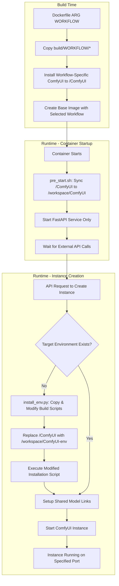
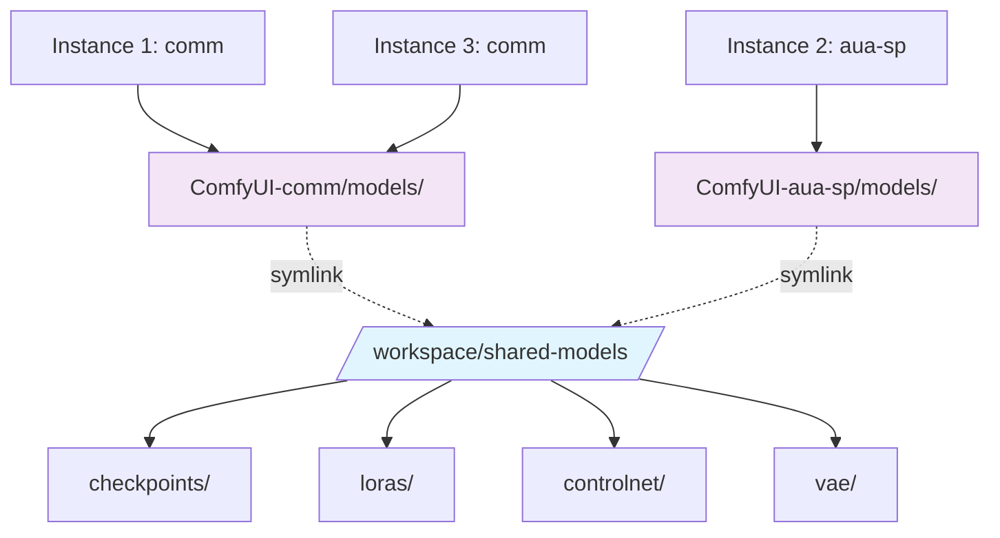
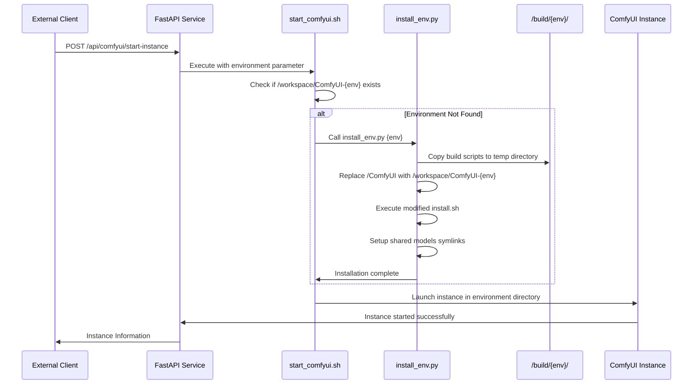
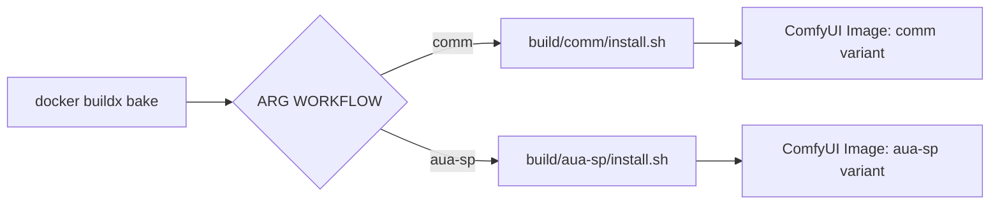

<div align="center">

# Multi-Instance ComfyUI Docker: Scalable AI Image Generation Platform

[](https://github.com/ashleykleynhans/comfyui-docker)
[](https://hub.docker.com/repository/docker/ashleykza/comfyui)
[](https://runpod.io/console/deploy?template=9eqyhd7vs0&ref=2xxro4sy)
<br>

![Template Version](https://img.shields.io/github/v/tag/ashleykleynhans/comfyui-docker?style=for-the-badge&logo=data%3Aimage%2Fsvg%2Bxml%3Bbase64%2CPD94bWwgdmVyc2lvbj0iMS4wIiBlbmNvZGluZz0idXRmLTgiPz4KPCEtLSBHZW5lcmF0b3I6IEFkb2JlIElsbHVzdHJhdG9yIDI2LjUuMywgU1ZHIEV4cG9ydCBQbHVnLUluIC4gU1ZHIFZlcnNpb246IDYuMDAgQnVpbGQgMCkgIC0tPgo8c3ZnIHZlcnNpb249IjEuMSIgaWQ9IkxheWVyXzEiIHhtbG5zPSJodHRwOi8vd3d3LnczLm9yZy8yMDAwL3N2ZyIgeG1sbnM6eGxpbms9Imh0dHA6Ly93d3cudzMub3JnLzE5OTkveGxpbmsiIHg9IjBweCIgeT0iMHB4IgoJIHZpZXdCb3g9IjAgMCAyMDAwIDIwMDAiIHN0eWxlPSJlbmFibGUtYmFja2dyb3VuZDpuZXcgMCAwIDIwMDAgMjAwMDsiIHhtbDpzcGFjZT0icHJlc2VydmUiPgo8c3R5bGUgdHlwZT0idGV4dC9jc3MiPgoJLnN0MHtmaWxsOiM2NzNBQjc7fQo8L3N0eWxlPgo8Zz4KCTxnPgoJCTxwYXRoIGNsYXNzPSJzdDAiIGQ9Ik0xMDE3Ljk1LDcxMS4wNGMtNC4yMiwyLjM2LTkuMTgsMy4wMS0xMy44NiwxLjgyTDM4Ni4xNyw1NTUuM2MtNDEuNzItMTAuNzYtODYuMDItMC42My0xMTYuNiwyOS43MwoJCQlsLTEuNCwxLjM5Yy0zNS45MiwzNS42NS0yNy41NSw5NS44LDE2Ljc0LDEyMC4zbDU4NC4zMiwzMjQuMjNjMzEuMzYsMTcuNCw1MC44Miw1MC40NSw1MC44Miw4Ni4zMnY4MDYuNzYKCQkJYzAsMzUuNDktMzguNDEsNTcuNjctNjkuMTUsMzkuOTRsLTcwMy4xNS00MDUuNjRjLTIzLjYtMTMuNjEtMzguMTMtMzguNzgtMzguMTMtNjYuMDJWNjY2LjYzYzAtODcuMjQsNDYuNDUtMTY3Ljg5LDEyMS45Mi0yMTEuNjYKCQkJTDkzMy44NSw0Mi4xNWMyMy40OC0xMy44LDUxLjQ3LTE3LjcsNzcuODMtMTAuODRsNzQ1LjcxLDE5NC4xYzMxLjUzLDguMjEsMzYuOTksNTAuNjUsOC41Niw2Ni41N0wxMDE3Ljk1LDcxMS4wNHoiLz4KCQk8cGF0aCBjbGFzcz0ic3QwIiBkPSJNMTUyNy43NSw1MzYuMzhsMTI4Ljg5LTc5LjYzbDE4OS45MiwxMDkuMTdjMjcuMjQsMTUuNjYsNDMuOTcsNDQuNzMsNDMuODIsNzYuMTVsLTQsODU3LjYKCQkJYy0wLjExLDI0LjM5LTEzLjE1LDQ2Ljg5LTM0LjI1LDU5LjExbC03MDEuNzUsNDA2LjYxYy0zMi4zLDE4LjcxLTcyLjc0LTQuNTktNzIuNzQtNDEuOTJ2LTc5Ny40MwoJCQljMC0zOC45OCwyMS4wNi03NC45MSw1NS4wNy05My45Nmw1OTAuMTctMzMwLjUzYzE4LjIzLTEwLjIxLDE4LjY1LTM2LjMsMC43NS00Ny4wOUwxNTI3Ljc1LDUzNi4zOHoiLz4KCQk8cGF0aCBjbGFzcz0ic3QwIiBkPSJNMTUyNC4wMSw2NjUuOTEiLz4KCTwvZz4KPC9nPgo8L3N2Zz4K&logoColor=%23ffffff&label=Template%20Version&color=%23673ab7)

**Language | 语言选择:** [English](README.md) | [中文](README_zh.md)

</div>

## 📑 Table of Contents

- [🚀 Key Features](#-key-features)
- [🏗️ System Architecture](#️-system-architecture)
- [📁 Directory Structure](#-directory-structure)
- [💻 Installs](#-installs)
- [🌐 Available on RunPod](#-available-on-runpod)
- [🛠️ Building the Docker image](#️-building-the-docker-image)
- [🚀 Running Locally](#-running-locally)
- [🔌 Ports](#-ports)
- [🎛️ Environment Variables](#️-environment-variables)
- [🔌 External API Usage](#-external-api-usage)
- [📊 Logs](#-logs)
- [🧠 Smart Environment Management System](#-smart-environment-management-system)
- [💡 Benefits of This Architecture](#-benefits-of-this-architecture)
- [📋 Multi-Instance Configuration](#-multi-instance-configuration)
- [🔧 External API Integration Examples](#-external-api-integration-examples)
- [🤖 FaceFusion Integration](#-facefusion-integration)
- [🐛 Troubleshooting](#-troubleshooting)
- [🤝 Community and Contributing](#-community-and-contributing)

## 🚀 Key Features

- **Multi-Instance Support**: Run multiple ComfyUI instances on a single machine with different configurations
- **Smart Environment Management**: Intelligent on-demand installation using build script replication and dynamic path replacement
- **Multi-Workflow Build Support**: Build different workflow-specific images (comm, aua-sp) with ARG-based configuration
- **Shared Model Architecture**: All instances share the same model files, dramatically reducing disk usage
- **External API Control**: Start, stop, and manage instances via RESTful API calls
- **Environment Isolation**: Each environment runs in isolated directories with dedicated virtual environments
- **Resource Efficient**: No ComfyUI instances run by default - only FastAPI service for external control
- **Build Script Replication**: Innovative build script copying and path modification for environment-specific installations

## 🏗️ System Architecture

### Build Time vs Runtime Architecture



### Shared Model Architecture



### Smart Environment Installation Flow



## 📁 Directory Structure

```
/workspace/
├── shared-models/              # Shared model storage (all instances)
│   ├── checkpoints/
│   ├── loras/
│   ├── controlnet/
│   └── vae/
├── ComfyUI-comm/               # Common environment
│   ├── models/ -> ../shared-models/
│   ├── custom_nodes/
│   └── venv/
├── ComfyUI-aua-sp/             # Specialized environment
│   ├── models/ -> ../shared-models/
│   ├── custom_nodes/
│   └── venv/
└── logs/                       # Instance logs
    ├── comfyui_instance_0.log
    ├── comfyui_instance_1.log
    └── ...
```

## 💻 Installs

* Ubuntu 22.04 LTS
* CUDA 12.8 / 12.4 (12.8 is default)
* Python 3.12.9 / 3.11.12 (3.12.9 is default)
* Torch 2.7.0 / 2.6.0 (2.7.0 is default)
* xformers 0.0.30 / 0.0.29.post3 (0.0.30 is default)
* [Jupyter Lab](https://github.com/jupyterlab/jupyterlab)
* [code-server](https://github.com/coder/code-server)
* [ComfyUI](https://github.com/comfyanonymous/ComfyUI) v0.3.40
* [runpodctl](https://github.com/runpod/runpodctl)
* [OhMyRunPod](https://github.com/kodxana/OhMyRunPod)
* [RunPod File Uploader](https://github.com/kodxana/RunPod-FilleUploader)
* [croc](https://github.com/schollz/croc)
* [rclone](https://rclone.org/)
* [Application Manager](https://github.com/ashleykleynhans/app-manager)
* [CivitAI Downloader](https://github.com/ashleykleynhans/civitai-downloader)

### 🔧 ComfyUI Custom Nodes

#### Common Environment (`comm`)
* [ComfyUI-Manager](https://github.com/ltdrdata/ComfyUI-Manager)
* [ComfyUI-Advanced-ControlNet](https://github.com/Kosinkadink/ComfyUI-Advanced-ControlNet)
* [comfyui_controlnet_aux](https://github.com/Fannovel16/comfyui_controlnet_aux)
* [comfyui-inpaint-nodes](https://github.com/Acly/comfyui-inpaint-nodes)
* [masquerade-nodes-comfyui](https://github.com/BadCafeCode/masquerade-nodes-comfyui)
* [ComfyUI-Florence2](https://github.com/kijai/ComfyUI-Florence2)
* [ComfyUI-segment-anything-2](https://github.com/kijai/ComfyUI-segment-anything-2)
* [ComfyUI_essentials](https://github.com/cubiq/ComfyUI_essentials)
* [ComfyUI-Custom-Scripts](https://github.com/pythongosssss/ComfyUI-Custom-Scripts)
* [ComfyUI_Comfyroll_CustomNodes](https://github.com/Suzie1/ComfyUI_Comfyroll_CustomNodes)
* [ComfyUI-Gemini_Flash_2.0_Exp](https://github.com/ShmuelRonen/ComfyUI-Gemini_Flash_2.0_Exp)
* [ComfyUI-FastAPI](https://github.com/Be-As-One/comfyui-fastapi)

#### Specialized Environment (`aua-sp`)
Includes all common nodes plus additional specialized models and LoRAs for advanced use cases.

## 🌐 Available on RunPod

This image is designed to work on [RunPod](https://runpod.io?ref=2xxro4sy).
You can use my custom [RunPod template](
https://runpod.io/console/deploy?template=9eqyhd7vs0&ref=2xxro4sy)
to launch it on RunPod.

## 🛠️ Building the Docker image

> [!NOTE]
> You will need to edit the `docker-bake.hcl` file and update `REGISTRY_USER`,
> and `RELEASE`.  You can obviously edit the other values too, but these
> are the most important ones.

> [!IMPORTANT]
> In order to cache the models, you will need at least 32GB of CPU/system
> memory (not VRAM) due to the large size of the models.  If you have less
> than 32GB of system memory, you can comment out or remove the code in the
> `Dockerfile` that caches the models.

```bash
# Clone the repo
git clone https://github.com/ashleykleynhans/comfyui-docker.git

# Log in to Docker Hub
docker login

# Build the default image (CUDA 12.8 and Python 3.12), tag the image, and push the image to Docker Hub
docker buildx bake -f docker-bake.hcl --push

# OR build a different image (eg. CUDA 12.4 and Python 3.11), tag the image, and push the image to Docker Hub
docker buildx bake -f docker-bake.hcl cu124-py311 --push

# OR build ALL images, tag the images, and push the images to Docker Hub
docker buildx bake -f docker-bake.hcl all --push

# Same as above but customize registry/user/release:
REGISTRY=ghcr.io REGISTRY_USER=myuser RELEASE=my-release docker buildx \
    bake -f docker-bake.hcl --push
```

## 🚀 Running Locally

### Install Nvidia CUDA Driver

- [Linux](https://docs.nvidia.com/cuda/cuda-installation-guide-linux/index.html)
- [Windows](https://docs.nvidia.com/cuda/cuda-installation-guide-microsoft-windows/index.html)

### Start the Docker container

```bash
docker run -d \
  --gpus all \
  -v /workspace \
  -p 2999:2999 \
  -p 3000-3010:3001-3011 \
  -p 7777:7777 \
  -p 8000:8000 \
  -p 8001:8001 \
  -p 8888:8888 \
  -e JUPYTER_PASSWORD=Jup1t3R! \
  -e DISABLE_AUTOLAUNCH=true \
  ashleykza/comfyui:latest
```

You can obviously substitute the image name and tag with your own.

## 🔌 Ports

| Connect Port | Internal Port | Description                      |
|--------------|---------------|----------------------------------|
| 3000-3010    | 3001-3011     | ComfyUI Instances (multi-port)   |
| 7777         | 7777          | Code Server                      |
| 8000         | 8000          | Application Manager              |
| 8001         | 8001          | FastAPI (Instance Management)    |
| 8888         | 8888          | Jupyter Lab                      |
| 2999         | 2999          | RunPod File Uploader             |

## 🎛️ Environment Variables

| Variable               | Description                                                                                 | Default               |
|------------------------|---------------------------------------------------------------------------------------------|-----------------------|
| JUPYTER_LAB_PASSWORD   | Set a password for Jupyter lab                                                              | not set - no password |
| DISABLE_AUTOLAUNCH     | Disable ComfyUI from launching automatically (recommended for multi-instance)              | true                  |
| SKIP_MODEL_DOWNLOAD    | Skip downloading models during environment installation (faster startup)                   | (not set)             |
| DISABLE_SYNC           | Disable syncing if using a RunPod network volume                                           | (not set)             |
| COMFYUI_ENVIRONMENT    | Default environment to use (comm/aua-sp)                                                   | comm                  |
| COMFYUI_BASE_PORT      | Base port for ComfyUI instances                                                            | 3001                  |
| EXTRA_ARGS             | Specify extra command line arguments for ComfyUI, eg. `--lowvram`, `--disable-xformers`   | (not set)             |

## 🔌 External API Usage

The container exposes a FastAPI service on port 8001 for managing ComfyUI instances externally.

### FastAPI Task Workflow System

The FastAPI service includes an intelligent task routing system that automatically distributes tasks to the appropriate ComfyUI environment based on workflow type:

#### Task Structure
When fetching a task via `/comfyui-fetch-task`, the system returns:
```json
{
    "taskId": "task_xxx",
    "workflow_name": "clothes_prompt_changer_with_auto",  // Workflow identifier
    "environment": "aua-us",                              // Target environment (auto-determined)
    "target_port": 3002,                                  // ComfyUI port (auto-determined)
    "params": {
        "input_data": {
            "wf_json": {...}  // Actual workflow JSON content
        }
    },
    "status": "PENDING"
}
```

**Note**: The `environment` and `target_port` fields are automatically determined by the system based on the `workflow_name`. They are output fields that inform the caller which environment and port to use for executing the workflow.

#### Workflow Routing Configuration
The system uses environment configuration files (`/config/environments/{environment}/config.json`) to map workflows to specific environments:
- `clothes_prompt_changer_with_auto` → `aua-us` (port 3002)
- `clothes_prompt_changer_with_mask` → `aua-us` (port 3002)
- Other workflows → Assigned based on configuration

#### Task API Endpoints
- `GET /comfyui-fetch-task` - Fetch next pending task
- `POST /comfyui-update-task` - Update task status
- `GET /tasks` - List all tasks
- `POST /tasks/create/{workflow_name}` - Create task for specific workflow
- `GET /workflows` - Get available workflows and mappings
- `GET /environments` - Get environment configurations

### Start Single Instance

```bash
curl -X POST "http://localhost:8001/api/comfyui/start-single" \
  -H "Content-Type: application/json" \
  -d '{
    "id": 0,
    "port": 3001,
    "name": "main-instance",
    "extra_args": "--lowvram",
    "enabled": true
  }' \
  --data-urlencode "environment=comm"
```

### Start Multiple Instances

```bash
curl -X POST "http://localhost:8001/api/comfyui/start-instances" \
  -H "Content-Type: application/json" \
  -d '{
    "environment": "comm",
    "instances": [
      {
        "id": 0,
        "port": 3001,
        "name": "main",
        "extra_args": "",
        "enabled": true
      },
      {
        "id": 1,
        "port": 3002,
        "name": "backup",
        "extra_args": "--lowvram",
        "enabled": true
      }
    ]
  }'
```

### Check Instance Status

```bash
curl -X GET "http://localhost:8001/api/comfyui/status"
```

### Stop All Instances

```bash
curl -X POST "http://localhost:8001/api/comfyui/stop-all"
```

### Direct Container Commands

```bash
# Start instance directly
docker exec your-container bash -c \
  'COMFYUI_ENVIRONMENT=comm INSTANCE_PORT=3001 INSTANCE_NAME=main /start_comfyui.sh 0'

# Check status
docker exec your-container /stop_comfyui.sh status

# Stop all instances
docker exec your-container /stop_comfyui.sh all

# Stop specific instance
docker exec your-container /stop_comfyui.sh instance 0
```


## 📊 Logs

ComfyUI creates separate log files for each instance:

| Application         | Log file                               |
|---------------------|----------------------------------------|
| ComfyUI Instance 0  | /workspace/logs/comfyui_instance_0.log |
| ComfyUI Instance 1  | /workspace/logs/comfyui_instance_1.log |
| ComfyUI Instance N  | /workspace/logs/comfyui_instance_N.log |
| FastAPI             | /workspace/logs/fastapi.log            |
| FaceFusion          | /workspace/logs/facefusion.log         |

You can tail individual instance logs:
```bash
tail -f /workspace/logs/comfyui_instance_0.log
```

## 🧠 Smart Environment Management System

This project features an innovative environment management system that combines build-time efficiency with runtime flexibility.

### Build Script Replication Technology

The system uses a sophisticated build script replication mechanism:

1. **Template Preparation**: Build scripts are prepared for each workflow type (`comm`, `aua-sp`) in `/build/{workflow}/`
2. **Dynamic Copy & Modify**: When a new environment is needed, `install_env.py` copies the build scripts to a temporary directory
3. **Path Transformation**: All paths in the scripts are dynamically replaced from `/ComfyUI` to `/workspace/ComfyUI-{environment}`
4. **Isolated Execution**: Modified scripts run in isolation, creating environment-specific installations

### Multi-Workflow Build System



### Environment Installation Process

When `start_comfyui.sh` detects a missing environment:

```bash
# Environment check in start_comfyui.sh
if [[ ! -d "${COMFYUI_DIR}" || ! -f "${COMFYUI_DIR}/main.py" ]]; then
    echo "COMFYUI: Environment ${COMFYUI_ENVIRONMENT} not found. Installing..."
    /install_env.py "${COMFYUI_ENVIRONMENT}"
fi
```

The installer performs these steps:
1. **Validation**: Checks if the requested environment is valid (`comm`, `aua-us`, `aua-sp`)
2. **Build Script Discovery**: Locates the appropriate build scripts in `/build/{environment}/`
3. **Template Copy**: Copies build scripts to a temporary working directory
4. **Path Replacement**: Replaces all `/ComfyUI` references with `/workspace/ComfyUI-{environment}`
5. **Execution**: Runs the modified installation script with environment variables
6. **Shared Model Setup**: Creates symbolic links to the shared model directory
7. **Custom Node Installation**: Downloads and installs environment-specific custom nodes
8. **Dependency Fixes**: Runs environment-specific dependency fix scripts (`fix_dependencies.sh`)
9. **Verification**: Validates the installation completed successfully

### Environment-Specific Configuration

Each environment now has its own configuration directory structure:

```
/config/environments/
├── comm/
│   ├── config.json          # Environment configuration (nodes, models, workflows)
│   └── fix_dependencies.sh  # Environment-specific dependency fixes
├── aua-us/
│   ├── config.json
│   └── fix_dependencies.sh
└── aua-sp/
    ├── config.json
    └── fix_dependencies.sh
```

This modular approach allows for:
- **Environment-Specific Dependencies**: Each environment can have different dependency requirements
- **Isolated Configuration**: Changes to one environment don't affect others
- **Maintainable Updates**: Easy to update specific environment configurations

## 💡 Benefits of This Architecture

### Technical Innovation
- **Build Script Replication**: Sophisticated build script copying and path transformation technology
- **Dynamic Path Replacement**: Automatic path modification from `/ComfyUI` to environment-specific paths
- **Multi-Workflow Build**: Single Dockerfile supports multiple workflow variants via ARG parameters
- **Template-Based Installation**: Reusable installation templates for consistent environment creation

### Resource Efficiency
- **Shared Models**: All instances share the same model files, saving GB of disk space
- **On-Demand Installation**: Environments are only installed when needed
- **No Idle Resources**: Container starts with minimal services running
- **Optimized Build Process**: Single base image supports multiple environment types

### Scalability
- **Multiple Instances**: Run different ComfyUI configurations simultaneously
- **Load Distribution**: Distribute workload across multiple instances
- **Environment Isolation**: Each environment has its own dependencies and custom nodes
- **Horizontal Scaling**: Easy replication of successful environment configurations

### Management Simplicity
- **External API Control**: Complete instance lifecycle management via REST API
- **Unified Logging**: Separate logs for each instance with consistent naming
- **Status Monitoring**: Real-time instance status and port information
- **Intelligent Environment Detection**: Automatic environment installation when needed

### Flexibility
- **Multi-Environment**: Support for different ComfyUI setups (comm, aua-sp)
- **Dynamic Configuration**: Each instance can have different startup parameters
- **Easy Integration**: Simple API integration with orchestration systems
- **Extensible Architecture**: Simple to add new workflow types and environments

## 📋 Multi-Instance Configuration

This system supports running multiple ComfyUI instances with flexible port assignment through configuration files. Perfect for GPU environments where you need multiple ComfyUI instances on different ports.

### Configuration File

The system uses `instances.json` configuration file located in the root directory (`/instances.json`). This file defines all instances with their specific settings.

#### Configuration Format
```json
{
  "instances": [
    {
      "id": 0,
      "port": 3001,
      "name": "comfyui-main",
      "description": "Main ComfyUI instance",
      "extra_args": "",
      "enabled": true
    },
    {
      "id": 1,
      "port": 3005,
      "name": "comfyui-backup",
      "description": "Backup ComfyUI instance",
      "extra_args": "",
      "enabled": true
    }
  ],
  "global_settings": {
    "log_directory": "/workspace/logs",
    "pid_directory": "/workspace/logs",
    "default_extra_args": "",
    "startup_delay": 2
  }
}
```

### Environment Variables (Legacy Support)
- `COMFYUI_ENABLE_MULTI_INSTANCE`: Set to "true" to enable multi-instance mode
- `COMFYUI_INSTANCES`: Number of instances (used for backward compatibility)

### Usage Examples

#### Basic Commands
```bash
# Start all enabled instances from configuration
/start_comfyui_multi.sh start

# Stop all instances
/start_comfyui_multi.sh stop

# Restart all instances
/start_comfyui_multi.sh restart

# Check status of all instances
/start_comfyui_multi.sh status
```

#### Advanced Commands
```bash
# Start specific instance by name
/start_comfyui_multi.sh start-by-name comfyui-main

# Stop specific instance by name
/start_comfyui_multi.sh stop-by-name comfyui-backup

# Start instances in a port range
/start_comfyui_multi.sh start-ports 3001-3005

# Show help and available commands
/start_comfyui_multi.sh help
```

#### Docker Integration
```bash
# Enable multi-instance mode with configuration file
docker run -e COMFYUI_ENABLE_MULTI_INSTANCE=true your-image

# Mount custom configuration
docker run -v /path/to/instances.json:/instances.json your-image
```

### Features

#### Flexible Port Assignment
Unlike traditional sequential port assignment, you can now assign any port to any instance:
```json
{
  "instances": [
    {"id": 0, "port": 3001, "name": "main"},
    {"id": 1, "port": 8080, "name": "web"},
    {"id": 2, "port": 9000, "name": "test"}
  ]
}
```

#### Instance Management
- **Named instances**: Each instance has a human-readable name
- **Enable/Disable**: Control which instances start automatically
- **Individual configuration**: Each instance can have different startup arguments
- **GPU-ready**: Designed for GPU environments with simple configuration

#### Log and PID Files
- **Log files**: `/workspace/logs/comfyui_instance_<id>.log`
- **PID files**: `/workspace/logs/comfyui_instance_<id>.pid`

#### Configuration Properties
- `id`: Unique identifier for the instance
- `port`: Port number for the instance
- `name`: Human-readable name
- `description`: Optional description
- `extra_args`: Additional ComfyUI arguments (e.g., "--lowvram")
- `enabled`: Whether this instance should start automatically

### Migrating from Environment Variables
If you were using the old environment variable approach:
```bash
# Old way
COMFYUI_INSTANCES=3 COMFYUI_BASE_PORT=3001

# New way - edit instances.json
{
  "instances": [
    {"id": 0, "port": 3001, "name": "instance-0", "enabled": true},
    {"id": 1, "port": 3002, "name": "instance-1", "enabled": true},  
    {"id": 2, "port": 3003, "name": "instance-2", "enabled": true}
  ]
}
```

## 🔧 External API Integration Examples

### Overview
This section provides comprehensive examples for integrating with the ComfyUI multi-instance system via external API calls.

### Container Setup
The ComfyUI container now starts with **no ComfyUI instances running by default**. Only the FastAPI service runs on port 8001. ComfyUI instances are started on-demand via external API calls.

### Python FastAPI Example

```python
import subprocess
import json
from fastapi import FastAPI, HTTPException
from pydantic import BaseModel
from typing import List, Optional

app = FastAPI()

# Configuration
CONTAINER_NAME = "your-comfyui-container"
DOCKER_EXEC_CMD = f"docker exec {CONTAINER_NAME}"

class ComfyUIInstance(BaseModel):
    id: int
    port: int
    name: str
    extra_args: Optional[str] = ""
    enabled: Optional[bool] = True

class StartInstancesRequest(BaseModel):
    environment: Optional[str] = "comm"  # Environment type: comm or aua-sp
    instances: List[ComfyUIInstance]

@app.post("/api/comfyui/start-instances")
async def start_comfyui_instances(request: StartInstancesRequest):
    """Start ComfyUI instances using direct environment variable approach"""
    
    results = []
    
    for instance in request.instances:
        if not instance.enabled:
            continue
            
        # Set environment variables and execute
        env_vars = f'COMFYUI_ENVIRONMENT={request.environment} INSTANCE_PORT={instance.port} INSTANCE_NAME={instance.name}'
        cmd = f'{DOCKER_EXEC_CMD} bash -c "{env_vars} /start_comfyui.sh {instance.id} \'{instance.extra_args}\'"'
    
        try:
            result = subprocess.run(cmd, shell=True, capture_output=True, text=True, timeout=60)
            
            if result.returncode == 0:
                results.append({
                    "instance_id": instance.id,
                    "name": instance.name,
                    "port": instance.port,
                    "status": "started",
                    "output": result.stdout
                })
            else:
                results.append({
                    "instance_id": instance.id,
                    "name": instance.name,
                    "port": instance.port,
                    "status": "failed",
                    "error": result.stderr
                })
                
        except subprocess.TimeoutExpired:
            results.append({
                "instance_id": instance.id,
                "name": instance.name,
                "port": instance.port,
                "status": "timeout"
            })
        except Exception as e:
            results.append({
                "instance_id": instance.id,
                "name": instance.name,
                "port": instance.port,
                "status": "error",
                "error": str(e)
            })
    
    return {
        "status": "completed",
        "environment": request.environment,
        "results": results,
        "total_instances": len(request.instances),
        "started_instances": len([r for r in results if r["status"] == "started"])
    }

@app.post("/api/comfyui/stop-all")
async def stop_all_instances():
    """Stop all running ComfyUI instances"""
    
    cmd = f'{DOCKER_EXEC_CMD} /stop_comfyui.sh all'
    
    try:
        result = subprocess.run(cmd, shell=True, capture_output=True, text=True, timeout=30)
        return {
            "status": "success",
            "message": "All instances stopped",
            "output": result.stdout
        }
    except Exception as e:
        raise HTTPException(status_code=500, detail=str(e))

@app.get("/api/comfyui/status")
async def get_instances_status():
    """Get status of all ComfyUI instances"""
    
    cmd = f'{DOCKER_EXEC_CMD} /stop_comfyui.sh status'
    
    try:
        result = subprocess.run(cmd, shell=True, capture_output=True, text=True, timeout=15)
        return {
            "status": "success",
            "output": result.stdout
        }
    except Exception as e:
        raise HTTPException(status_code=500, detail=str(e))

@app.post("/api/comfyui/start-single")
async def start_single_instance(instance: ComfyUIInstance, environment: str = "comm"):
    """Start a single ComfyUI instance"""
    
    # Set environment variables and execute
    env_vars = f'COMFYUI_ENVIRONMENT={environment} INSTANCE_PORT={instance.port} INSTANCE_NAME={instance.name}'
    cmd = f'{DOCKER_EXEC_CMD} bash -c "{env_vars} /start_comfyui.sh {instance.id} \'{instance.extra_args}\'"'
    
    try:
        result = subprocess.run(cmd, shell=True, capture_output=True, text=True, timeout=30)
        
        if result.returncode == 0:
            return {
                "status": "success",
                "message": f"Instance '{instance.name}' started on port {instance.port}",
                "output": result.stdout
            }
        else:
            raise HTTPException(
                status_code=500, 
                detail=f"Failed to start instance: {result.stderr}"
            )
    except Exception as e:
        raise HTTPException(status_code=500, detail=str(e))
```

### Usage Examples

#### 1. Start Multiple Instances
```bash
curl -X POST "http://your-api-host/api/comfyui/start-instances" \
  -H "Content-Type: application/json" \
  -d '{
    "environment": "comm",
    "instances": [
      {
        "id": 0,
        "port": 3001,
        "name": "comfyui-main",
        "extra_args": "",
        "enabled": true
      },
      {
        "id": 1,
        "port": 3005,
        "name": "comfyui-backup",
        "extra_args": "--lowvram",
        "enabled": true
      }
    ]
  }'
```

#### 2. Start Single Instance
```bash
curl -X POST "http://your-api-host/api/comfyui/start-single" \
  -H "Content-Type: application/json" \
  -d '{
    "id": 0,
    "port": 3001,
    "name": "comfyui-quick",
    "extra_args": "",
    "enabled": true
  }'
```

#### 3. Check Status
```bash
curl -X GET "http://your-api-host/api/comfyui/status"
```

#### 4. Stop All Instances
```bash
curl -X POST "http://your-api-host/api/comfyui/stop-all"
```

### Direct Container Commands

You can also interact directly with the container:

```bash
# Start single instance with environment variables
docker exec your-container bash -c \
  'COMFYUI_ENVIRONMENT=comm INSTANCE_PORT=3001 INSTANCE_NAME=main /start_comfyui.sh 0'

# Start multiple instances
docker exec your-container bash -c \
  'COMFYUI_ENVIRONMENT=comm INSTANCE_PORT=3001 INSTANCE_NAME=main /start_comfyui.sh 0'
docker exec your-container bash -c \
  'COMFYUI_ENVIRONMENT=aua-sp INSTANCE_PORT=3002 INSTANCE_NAME=backup /start_comfyui.sh 1'

# Check status
docker exec your-container /stop_comfyui.sh status

# Stop all instances
docker exec your-container /stop_comfyui.sh all

# Stop specific instance
docker exec your-container /stop_comfyui.sh instance 0
```

### Node.js Express Example

```javascript
const express = require('express');
const { exec } = require('child_process');
const app = express();

app.use(express.json());

const CONTAINER_NAME = 'your-comfyui-container';

app.post('/api/comfyui/start-instances', (req, res) => {
    const { instances } = req.body;
    
    if (!instances || !Array.isArray(instances)) {
        return res.status(400).json({ error: 'Invalid instances array' });
    }
    
    const jsonConfig = JSON.stringify({ instances });
    const cmd = `docker exec ${CONTAINER_NAME} /start_comfyui_multi.sh json '${jsonConfig}'`;
    
    exec(cmd, { timeout: 60000 }, (error, stdout, stderr) => {
        if (error) {
            return res.status(500).json({ error: error.message, stderr });
        }
        
        res.json({
            status: 'success',
            message: 'Instances started',
            output: stdout,
            instances_count: instances.length
        });
    });
});

app.listen(3000, () => {
    console.log('ComfyUI API server running on port 3000');
});
```

### Configuration Notes

#### JSON Configuration Format
```json
{
  "environment": "comm",     // Environment type: "comm" or "aua-sp"
  "instances": [
    {
      "id": 0,               // Unique instance ID
      "port": 3001,          // Port for this instance
      "name": "main",        // Human-readable name
      "extra_args": "",      // Additional ComfyUI arguments
      "enabled": true        // Whether to start this instance
    }
  ]
}
```

#### Environment Variables
- `DISABLE_AUTOLAUNCH=true` (default) - ComfyUI won't start automatically
- `DISABLE_AUTOLAUNCH=false` - Enable automatic startup using instances.json

#### Port Management
- ComfyUI instances: 3001+ (configurable)
- FastAPI service: 8001 (always running)
- Choose ports that don't conflict with other services

#### Environment Types
- **comm**: Standard ComfyUI environment with common models and nodes
- **aua-sp**: Specialized environment with additional features and models

#### Shared Models Architecture
The system uses a shared model storage to optimize disk space and startup time:

```
/workspace/
├── shared-models/              # Shared model storage (soft-linked)
│   ├── checkpoints/
│   ├── loras/
│   ├── controlnet/
│   └── vae/
│
├── ComfyUI-comm/               # comm environment
│   ├── models/                 # symlink -> /workspace/shared-models/
│   ├── custom_nodes/           # environment-specific nodes
│   └── venv/                   # environment-specific Python env
│
└── ComfyUI-aua-sp/             # aua-sp environment
    ├── models/                 # symlink -> /workspace/shared-models/
    ├── custom_nodes/           # environment-specific nodes
    └── venv/                   # environment-specific Python env
```

**Benefits**:
- Models are stored only once, saving GB of disk space
- Fast environment switching without re-downloading models
- Each environment has isolated custom nodes and dependencies

### Benefits of This Approach

1. **Resource Efficiency**: No ComfyUI instances running until needed
2. **Dynamic Configuration**: Each startup can use different settings
3. **External Control**: Complete management via API calls
4. **Scalability**: Easy to integrate with orchestration systems
5. **Flexibility**: Support both file-based and API-driven configuration
6. **Space Optimization**: Shared model storage reduces disk usage
7. **Multi-Environment**: Support different ComfyUI configurations simultaneously

## 🤖 FaceFusion Integration

This section describes the FaceFusion face swap integration for the ComfyUI Docker setup.

### Overview

The FaceFusion integration allows running face swap services using the Be-As-One fork of FaceFusion within the ComfyUI Docker environment. The integration includes:

- Custom installation script for the Be-As-One FaceFusion fork
- Dedicated startup script for FaceFusion service
- Integration with external FastAPI handler
- Docker build targets for FaceFusion workflows

### Key Components

#### 1. Installation Script
**Location:** `build/facefusion/install.sh`
- Installs FaceFusion from `git@github.com:Be-As-One/facefusion.git`
- Sets up micromamba environment with Python 3.12
- Installs PyTorch and FaceFusion dependencies

#### 2. Startup Script
**Location:** `scripts/start_facefusion.sh`
- Manages FaceFusion service lifecycle
- Integrates with external FastAPI handler at `/Users/hzy/Code/zhuilai/video-faceswap/fastapi_handler.py`
- Handles environment activation and logging

#### 3. Environment Configuration
**Location:** `config/environments/facefusion/config.json`
- Service runs on port 3005
- Configured for face swap workflows
- Specifies external FastAPI handler integration

#### 4. Docker Build Configuration
**Location:** `docker-bake.hcl`
- Added `facefusion` group with CUDA 12.4 and 12.8 targets
- Includes FaceFusion-specific build arguments
- Supports both `facefusion-cu124-py312` and `facefusion-cu128-py312` targets

### Usage

#### Building FaceFusion Docker Image

```bash
# Build FaceFusion images for all CUDA versions
docker buildx bake facefusion

# Build specific CUDA version
docker buildx bake facefusion-cu128-py312
```

#### Running FaceFusion Container

```bash
# Run with external FastAPI handler mounted
docker run -d \
  --name comfyui-facefusion \
  --gpus all \
  -p 3005:3005 \
  -v /Users/hzy/Code/zhuilai/video-faceswap:/external/video-faceswap \
  your-registry/comfyui:facefusion-cu128-py312-latest

# Start FaceFusion service inside container
docker exec comfyui-facefusion /start_facefusion.sh
```

#### Service Management

```bash
# Check FaceFusion service status
docker exec comfyui-facefusion /start_facefusion.sh status

# View service logs
docker exec comfyui-facefusion tail -f /workspace/logs/facefusion.log

# Stop service (if needed)
docker exec comfyui-facefusion pkill -f fastapi_handler.py
```

### Requirements

#### External Dependencies
- **FaceFusion FastAPI Handler**: `/Users/hzy/Code/zhuilai/video-faceswap/fastapi_handler.py`
- **Video FaceSwap Repository**: Must be available at runtime for volume mounting

#### System Requirements
- NVIDIA GPU with CUDA support
- Docker with BuildKit support
- Sufficient disk space for FaceFusion models

### API Endpoints

Once running, FaceFusion service exposes API endpoints on port 3005:

```bash
# Health check
curl http://localhost:3005/health

# Face swap processing
curl -X POST http://localhost:3005/process \
  -H "Content-Type: application/json" \
  -d '{
    "source_url": "https://example.com/source.jpg",
    "target_url": "https://example.com/target.jpg",
    "resolution": "1024x1024",
    "model": "inswapper_128_fp16"
  }'
```

### Integration Testing

Run the integration test to verify setup:

```bash
cd /path/to/comfyui-docker
./scripts/test_facefusion_integration.sh
```

### Architecture Notes

- FaceFusion runs in isolated micromamba environment (`facefusion`)
- External FastAPI handler provides REST API interface
- Service integrates with existing ComfyUI Docker infrastructure
- Shared model storage architecture reduces disk usage
- Environment configuration allows for future workflow extensions

### Version Information

- **FaceFusion Version**: 3.0.0 (configurable via `FACEFUSION_VERSION` build arg)
- **Python Version**: 3.12
- **CUDA Support**: 12.4 and 12.8
- **PyTorch Version**: 2.6.0+ (CUDA 12.4) / 2.7.0+ (CUDA 12.8)

## 🐛 Troubleshooting

### Common Issues

#### Docker Build Issues

**Problem**: "failed to find target cu124-py312" error
- **Solution**: Ensure you're using the latest `docker-bake.hcl` file. All build targets have been unified and the `-comm` suffix removed.
- **Test**: Run `docker buildx bake --print cu124-py312` to verify the target exists.

#### Multi-Instance Issues

**Problem**: Instances fail to start
- Check if ports are already in use: `netstat -tlnp | grep 300`
- Verify instances.json configuration: `cat /instances.json`
- Check instance logs: `tail -f /workspace/logs/comfyui_instance_0.log`

**Problem**: Environment not found error
- The environment will be automatically installed on first use
- Check installation logs: `tail -f /workspace/logs/install_env.log`
- Verify environment exists: `ls -la /workspace/ComfyUI-*`

#### FaceFusion Issues

**Problem**: External FastAPI Handler Not Found
- Ensure `/Users/hzy/Code/zhuilai/video-faceswap/fastapi_handler.py` exists
- Check volume mount in Docker run command

**Problem**: FaceFusion Installation Fails
- Verify SSH access to GitHub for `git@github.com:Be-As-One/facefusion.git`
- Check build logs for dependency issues

**Problem**: Service Won't Start
- Check micromamba environment activation
- Verify Python dependencies are installed
- Review logs at `/workspace/logs/facefusion.log`

### Debug Commands

```bash
# Check running instances
docker exec your-container ps aux | grep comfyui

# Check port usage
docker exec your-container netstat -tlnp

# Check disk space
docker exec your-container df -h

# Check GPU availability
docker exec your-container nvidia-smi

# Check Python environments
docker exec your-container ls -la /workspace/ComfyUI-*/venv/

# Check micromamba environments (for FaceFusion)
docker exec comfyui-facefusion micromamba env list

# Test FaceFusion installation
docker exec comfyui-facefusion ls -la /facefusion

# Check Python environment
docker exec comfyui-facefusion micromamba activate facefusion && python -c "import facefusion; print('OK')"
```

### Performance Optimization

1. **GPU Memory Issues**
   - Use `--lowvram` flag in instance extra_args
   - Reduce batch size in workflows
   - Monitor with `nvidia-smi`

2. **Disk Space Management**
   - Shared models save significant space
   - Clean unused environments: `rm -rf /workspace/ComfyUI-unused`
   - Clear cache: `rm -rf /workspace/.cache/*`

3. **Network Performance**
   - Use local model storage when possible
   - Configure proper DNS in container
   - Check firewall rules for API access

### Getting Help

1. Check the logs first - they usually contain helpful error messages
2. Verify your configuration matches the examples
3. Try with minimal configuration first, then add complexity
4. Report issues on [GitHub](https://github.com/ashleykleynhans/comfyui-docker) with:
   - Docker version
   - GPU model and driver version
   - Full error logs
   - Configuration files used

## 🤝 Community and Contributing

Pull requests and issues on [GitHub](https://github.com/ashleykleynhans/comfyui-docker)
are welcome. Bug fixes and new features are encouraged.
