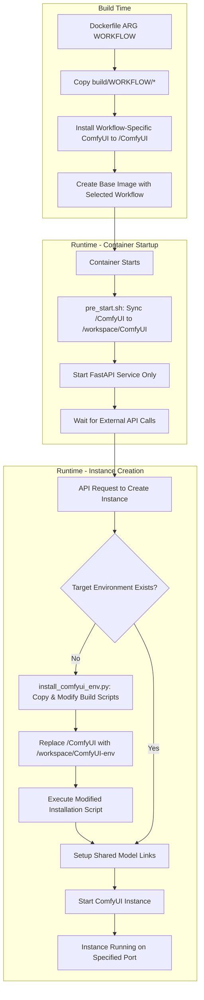
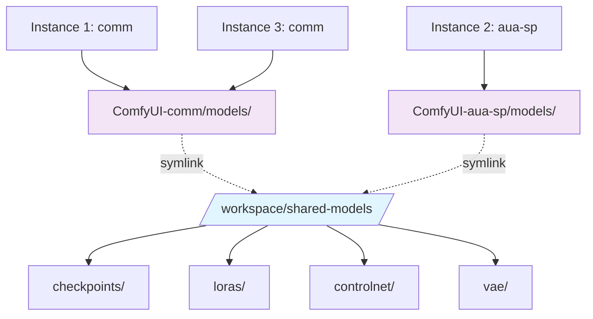
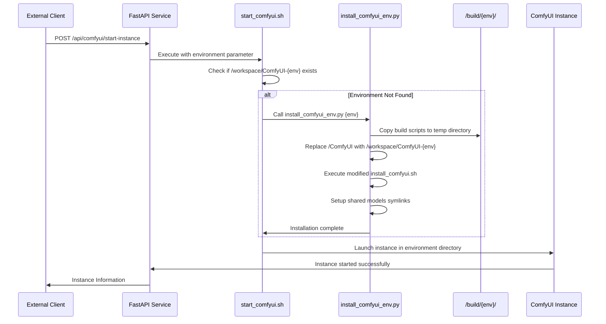
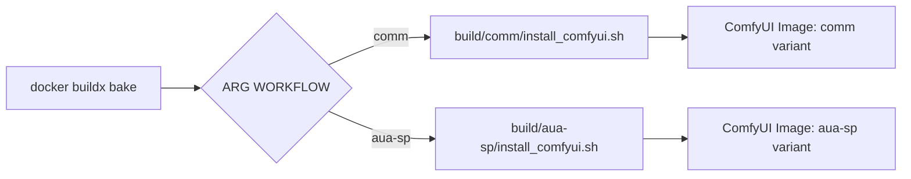

<div align="center">

# Multi-Instance ComfyUI Docker: Scalable AI Image Generation Platform

[](https://github.com/ashleykleynhans/comfyui-docker)
[](https://hub.docker.com/repository/docker/ashleykza/comfyui)
[](https://runpod.io/console/deploy?template=9eqyhd7vs0&ref=2xxro4sy)
<br>

![Template Version](https://img.shields.io/github/v/tag/ashleykleynhans/comfyui-docker?style=for-the-badge&logo=data%3Aimage%2Fsvg%2Bxml%3Bbase64%2CPD94bWwgdmVyc2lvbj0iMS4wIiBlbmNvZGluZz0idXRmLTgiPz4KPCEtLSBHZW5lcmF0b3I6IEFkb2JlIElsbHVzdHJhdG9yIDI2LjUuMywgU1ZHIEV4cG9ydCBQbHVnLUluIC4gU1ZHIFZlcnNpb246IDYuMDAgQnVpbGQgMCkgIC0tPgo8c3ZnIHZlcnNpb249IjEuMSIgaWQ9IkxheWVyXzEiIHhtbG5zPSJodHRwOi8vd3d3LnczLm9yZy8yMDAwL3N2ZyIgeG1sbnM6eGxpbms9Imh0dHA6Ly93d3cudzMub3JnLzE5OTkveGxpbmsiIHg9IjBweCIgeT0iMHB4IgoJIHZpZXdCb3g9IjAgMCAyMDAwIDIwMDAiIHN0eWxlPSJlbmFibGUtYmFja2dyb3VuZDpuZXcgMCAwIDIwMDAgMjAwMDsiIHhtbDpzcGFjZT0icHJlc2VydmUiPgo8c3R5bGUgdHlwZT0idGV4dC9jc3MiPgoJLnN0MHtmaWxsOiM2NzNBQjc7fQo8L3N0eWxlPgo8Zz4KCTxnPgoJCTxwYXRoIGNsYXNzPSJzdDAiIGQ9Ik0xMDE3Ljk1LDcxMS4wNGMtNC4yMiwyLjM2LTkuMTgsMy4wMS0xMy44NiwxLjgyTDM4Ni4xNyw1NTUuM2MtNDEuNzItMTAuNzYtODYuMDItMC42My0xMTYuNiwyOS43MwoJCQlsLTEuNCwxLjM5Yy0zNS45MiwzNS42NS0yNy41NSw5NS44LDE2Ljc0LDEyMC4zbDU4NC4zMiwzMjQuMjNjMzEuMzYsMTcuNCw1MC44Miw1MC40NSw1MC44Miw4Ni4zMnY4MDYuNzYKCQkJYzAsMzUuNDktMzguNDEsNTcuNjctNjkuMTUsMzkuOTRsLTcwMy4xNS00MDUuNjRjLTIzLjYtMTMuNjEtMzguMTMtMzguNzgtMzguMTMtNjYuMDJWNjY2LjYzYzAtODcuMjQsNDYuNDUtMTY3Ljg5LDEyMS45Mi0yMTEuNjYKCQkJTDkzMy44NSw0Mi4xNWMyMy40OC0xMy44LDUxLjQ3LTE3LjcsNzcuODMtMTAuODRsNzQ1LjcxLDE5NC4xYzMxLjUzLDguMjEsMzYuOTksNTAuNjUsOC41Niw2Ni41N0wxMDE3Ljk1LDcxMS4wNHoiLz4KCQk8cGF0aCBjbGFzcz0ic3QwIiBkPSJNMTUyNy43NSw1MzYuMzhsMTI4Ljg5LTc5LjYzbDE4OS45MiwxMDkuMTdjMjcuMjQsMTUuNjYsNDMuOTcsNDQuNzMsNDMuODIsNzYuMTVsLTQsODU3LjYKCQkJYy0wLjExLDI0LjM5LTEzLjE1LDQ2Ljg5LTM0LjI1LDU5LjExbC03MDEuNzUsNDA2LjYxYy0zMi4zLDE4LjcxLTcyLjc0LTQuNTktNzIuNzQtNDEuOTJ2LTc5Ny40MwoJCQljMC0zOC45OCwyMS4wNi03NC45MSw1NS4wNy05My45Nmw1OTAuMTctMzMwLjUzYzE4LjIzLTEwLjIxLDE4LjY1LTM2LjMsMC43NS00Ny4wOUwxNTI3Ljc1LDUzNi4zOHoiLz4KCQk8cGF0aCBjbGFzcz0ic3QwIiBkPSJNMTUyNC4wMSw2NjUuOTEiLz4KCTwvZz4KPC9nPgo8L3N2Zz4K&logoColor=%23ffffff&label=Template%20Version&color=%23673ab7)

**Language | 语言选择:** [English](README.md) | [中文](README_zh.md)

</div>

## 🚀 Key Features

- **Multi-Instance Support**: Run multiple ComfyUI instances on a single machine with different configurations
- **Smart Environment Management**: Intelligent on-demand installation using build script replication and dynamic path replacement
- **Multi-Workflow Build Support**: Build different workflow-specific images (comm, aua-sp) with ARG-based configuration
- **Shared Model Architecture**: All instances share the same model files, dramatically reducing disk usage
- **External API Control**: Start, stop, and manage instances via RESTful API calls
- **Environment Isolation**: Each environment runs in isolated directories with dedicated virtual environments
- **Resource Efficient**: No ComfyUI instances run by default - only FastAPI service for external control
- **Build Script Replication**: Innovative build script copying and path modification for environment-specific installations

## 🏗️ System Architecture

### Build Time vs Runtime Architecture



### Shared Model Architecture



### Smart Environment Installation Flow



## 📁 Directory Structure

```
/workspace/
├── shared-models/              # Shared model storage (all instances)
│   ├── checkpoints/
│   ├── loras/
│   ├── controlnet/
│   └── vae/
├── ComfyUI-comm/               # Common environment
│   ├── models/ -> ../shared-models/
│   ├── custom_nodes/
│   └── venv/
├── ComfyUI-aua-sp/             # Specialized environment
│   ├── models/ -> ../shared-models/
│   ├── custom_nodes/
│   └── venv/
└── logs/                       # Instance logs
    ├── comfyui_instance_0.log
    ├── comfyui_instance_1.log
    └── ...
```

## 💻 Installs

* Ubuntu 22.04 LTS
* CUDA 12.8 / 12.4 (12.8 is default)
* Python 3.12.9 / 3.11.12 (3.12.9 is default)
* Torch 2.7.0 / 2.6.0 (2.7.0 is default)
* xformers 0.0.30 / 0.0.29.post3 (0.0.30 is default)
* [Jupyter Lab](https://github.com/jupyterlab/jupyterlab)
* [code-server](https://github.com/coder/code-server)
* [ComfyUI](https://github.com/comfyanonymous/ComfyUI) v0.3.40
* [runpodctl](https://github.com/runpod/runpodctl)
* [OhMyRunPod](https://github.com/kodxana/OhMyRunPod)
* [RunPod File Uploader](https://github.com/kodxana/RunPod-FilleUploader)
* [croc](https://github.com/schollz/croc)
* [rclone](https://rclone.org/)
* [Application Manager](https://github.com/ashleykleynhans/app-manager)
* [CivitAI Downloader](https://github.com/ashleykleynhans/civitai-downloader)

### 🔧 ComfyUI Custom Nodes

#### Common Environment (`comm`)
* [ComfyUI-Manager](https://github.com/ltdrdata/ComfyUI-Manager)
* [ComfyUI-Advanced-ControlNet](https://github.com/Kosinkadink/ComfyUI-Advanced-ControlNet)
* [comfyui_controlnet_aux](https://github.com/Fannovel16/comfyui_controlnet_aux)
* [comfyui-inpaint-nodes](https://github.com/Acly/comfyui-inpaint-nodes)
* [masquerade-nodes-comfyui](https://github.com/BadCafeCode/masquerade-nodes-comfyui)
* [ComfyUI-Florence2](https://github.com/kijai/ComfyUI-Florence2)
* [ComfyUI-segment-anything-2](https://github.com/kijai/ComfyUI-segment-anything-2)
* [ComfyUI_essentials](https://github.com/cubiq/ComfyUI_essentials)
* [ComfyUI-Custom-Scripts](https://github.com/pythongosssss/ComfyUI-Custom-Scripts)
* [ComfyUI_Comfyroll_CustomNodes](https://github.com/Suzie1/ComfyUI_Comfyroll_CustomNodes)
* [ComfyUI-Gemini_Flash_2.0_Exp](https://github.com/ShmuelRonen/ComfyUI-Gemini_Flash_2.0_Exp)
* [ComfyUI-FastAPI](https://github.com/Be-As-One/comfyui-fastapi)

#### Specialized Environment (`aua-sp`)
Includes all common nodes plus additional specialized models and LoRAs for advanced use cases.

## 🌐 Available on RunPod

This image is designed to work on [RunPod](https://runpod.io?ref=2xxro4sy).
You can use my custom [RunPod template](
https://runpod.io/console/deploy?template=9eqyhd7vs0&ref=2xxro4sy)
to launch it on RunPod.

## 🛠️ Building the Docker image

> [!NOTE]
> You will need to edit the `docker-bake.hcl` file and update `REGISTRY_USER`,
> and `RELEASE`.  You can obviously edit the other values too, but these
> are the most important ones.

> [!IMPORTANT]
> In order to cache the models, you will need at least 32GB of CPU/system
> memory (not VRAM) due to the large size of the models.  If you have less
> than 32GB of system memory, you can comment out or remove the code in the
> `Dockerfile` that caches the models.

```bash
# Clone the repo
git clone https://github.com/ashleykleynhans/comfyui-docker.git

# Log in to Docker Hub
docker login

# Build the default image (CUDA 12.8 and Python 3.12), tag the image, and push the image to Docker Hub
docker buildx bake -f docker-bake.hcl --push

# OR build a different image (eg. CUDA 12.4 and Python 3.11), tag the image, and push the image to Docker Hub
docker buildx bake -f docker-bake.hcl cu124-py311 --push

# OR build ALL images, tag the images, and push the images to Docker Hub
docker buildx bake -f docker-bake.hcl all --push

# Same as above but customize registry/user/release:
REGISTRY=ghcr.io REGISTRY_USER=myuser RELEASE=my-release docker buildx \
    bake -f docker-bake.hcl --push
```

## 🚀 Running Locally

### Install Nvidia CUDA Driver

- [Linux](https://docs.nvidia.com/cuda/cuda-installation-guide-linux/index.html)
- [Windows](https://docs.nvidia.com/cuda/cuda-installation-guide-microsoft-windows/index.html)

### Start the Docker container

```bash
docker run -d \
  --gpus all \
  -v /workspace \
  -p 2999:2999 \
  -p 3000-3010:3001-3011 \
  -p 7777:7777 \
  -p 8000:8000 \
  -p 8001:8001 \
  -p 8888:8888 \
  -e JUPYTER_PASSWORD=Jup1t3R! \
  -e DISABLE_AUTOLAUNCH=true \
  ashleykza/comfyui:latest
```

You can obviously substitute the image name and tag with your own.

## 🔌 Ports

| Connect Port | Internal Port | Description                      |
|--------------|---------------|----------------------------------|
| 3000-3010    | 3001-3011     | ComfyUI Instances (multi-port)   |
| 7777         | 7777          | Code Server                      |
| 8000         | 8000          | Application Manager              |
| 8001         | 8001          | FastAPI (Instance Management)    |
| 8888         | 8888          | Jupyter Lab                      |
| 2999         | 2999          | RunPod File Uploader             |

## 🎛️ Environment Variables

| Variable               | Description                                                                                 | Default               |
|------------------------|---------------------------------------------------------------------------------------------|-----------------------|
| JUPYTER_LAB_PASSWORD   | Set a password for Jupyter lab                                                              | not set - no password |
| DISABLE_AUTOLAUNCH     | Disable ComfyUI from launching automatically (recommended for multi-instance)              | true                  |
| SKIP_MODEL_DOWNLOAD    | Skip downloading models during environment installation (faster startup)                   | (not set)             |
| DISABLE_SYNC           | Disable syncing if using a RunPod network volume                                           | (not set)             |
| COMFYUI_ENVIRONMENT    | Default environment to use (comm/aua-sp)                                                   | comm                  |
| COMFYUI_BASE_PORT      | Base port for ComfyUI instances                                                            | 3001                  |
| EXTRA_ARGS             | Specify extra command line arguments for ComfyUI, eg. `--lowvram`, `--disable-xformers`   | (not set)             |

## 🔌 External API Usage

The container exposes a FastAPI service on port 8001 for managing ComfyUI instances externally.

### Start Single Instance

```bash
curl -X POST "http://localhost:8001/api/comfyui/start-single" \
  -H "Content-Type: application/json" \
  -d '{
    "id": 0,
    "port": 3001,
    "name": "main-instance",
    "extra_args": "--lowvram",
    "enabled": true
  }' \
  --data-urlencode "environment=comm"
```

### Start Multiple Instances

```bash
curl -X POST "http://localhost:8001/api/comfyui/start-instances" \
  -H "Content-Type: application/json" \
  -d '{
    "environment": "comm",
    "instances": [
      {
        "id": 0,
        "port": 3001,
        "name": "main",
        "extra_args": "",
        "enabled": true
      },
      {
        "id": 1,
        "port": 3002,
        "name": "backup",
        "extra_args": "--lowvram",
        "enabled": true
      }
    ]
  }'
```

### Check Instance Status

```bash
curl -X GET "http://localhost:8001/api/comfyui/status"
```

### Stop All Instances

```bash
curl -X POST "http://localhost:8001/api/comfyui/stop-all"
```

### Direct Container Commands

```bash
# Start instance directly
docker exec your-container bash -c \
  'COMFYUI_ENVIRONMENT=comm INSTANCE_PORT=3001 INSTANCE_NAME=main /start_comfyui.sh 0'

# Check status
docker exec your-container /stop_comfyui.sh status

# Stop all instances
docker exec your-container /stop_comfyui.sh all

# Stop specific instance
docker exec your-container /stop_comfyui.sh instance 0
```

> For detailed API documentation and advanced usage examples, see:
> - [scripts/EXTERNAL_API_EXAMPLE.md](scripts/EXTERNAL_API_EXAMPLE.md) - Complete API integration guide
> - [scripts/MULTI_INSTANCE_USAGE.md](scripts/MULTI_INSTANCE_USAGE.md) - Multi-instance configuration guide

## 📊 Logs

ComfyUI creates separate log files for each instance:

| Application         | Log file                               |
|---------------------|----------------------------------------|
| ComfyUI Instance 0  | /workspace/logs/comfyui_instance_0.log |
| ComfyUI Instance 1  | /workspace/logs/comfyui_instance_1.log |
| ComfyUI Instance N  | /workspace/logs/comfyui_instance_N.log |
| FastAPI             | /workspace/logs/fastapi.log            |

You can tail individual instance logs:
```bash
tail -f /workspace/logs/comfyui_instance_0.log
```

## 🧠 Smart Environment Management System

This project features an innovative environment management system that combines build-time efficiency with runtime flexibility.

### Build Script Replication Technology

The system uses a sophisticated build script replication mechanism:

1. **Template Preparation**: Build scripts are prepared for each workflow type (`comm`, `aua-sp`) in `/build/{workflow}/`
2. **Dynamic Copy & Modify**: When a new environment is needed, `install_comfyui_env.py` copies the build scripts to a temporary directory
3. **Path Transformation**: All paths in the scripts are dynamically replaced from `/ComfyUI` to `/workspace/ComfyUI-{environment}`
4. **Isolated Execution**: Modified scripts run in isolation, creating environment-specific installations

### Multi-Workflow Build System



### Environment Installation Process

When `start_comfyui.sh` detects a missing environment:

```bash
# Environment check in start_comfyui.sh
if [[ ! -d "${COMFYUI_DIR}" || ! -f "${COMFYUI_DIR}/main.py" ]]; then
    echo "COMFYUI: Environment ${COMFYUI_ENVIRONMENT} not found. Installing..."
    /install_comfyui_env.py "${COMFYUI_ENVIRONMENT}"
fi
```

The installer performs these steps:
1. **Validation**: Checks if the requested environment is valid (`comm` or `aua-sp`)
2. **Build Script Discovery**: Locates the appropriate build scripts in `/build/{environment}/`
3. **Template Copy**: Copies build scripts to a temporary working directory
4. **Path Replacement**: Replaces all `/ComfyUI` references with `/workspace/ComfyUI-{environment}`
5. **Execution**: Runs the modified installation script with environment variables
6. **Shared Model Setup**: Creates symbolic links to the shared model directory
7. **Verification**: Validates the installation completed successfully

## 💡 Benefits of This Architecture

### Technical Innovation
- **Build Script Replication**: Sophisticated build script copying and path transformation technology
- **Dynamic Path Replacement**: Automatic path modification from `/ComfyUI` to environment-specific paths
- **Multi-Workflow Build**: Single Dockerfile supports multiple workflow variants via ARG parameters
- **Template-Based Installation**: Reusable installation templates for consistent environment creation

### Resource Efficiency
- **Shared Models**: All instances share the same model files, saving GB of disk space
- **On-Demand Installation**: Environments are only installed when needed
- **No Idle Resources**: Container starts with minimal services running
- **Optimized Build Process**: Single base image supports multiple environment types

### Scalability
- **Multiple Instances**: Run different ComfyUI configurations simultaneously
- **Load Distribution**: Distribute workload across multiple instances
- **Environment Isolation**: Each environment has its own dependencies and custom nodes
- **Horizontal Scaling**: Easy replication of successful environment configurations

### Management Simplicity
- **External API Control**: Complete instance lifecycle management via REST API
- **Unified Logging**: Separate logs for each instance with consistent naming
- **Status Monitoring**: Real-time instance status and port information
- **Intelligent Environment Detection**: Automatic environment installation when needed

### Flexibility
- **Multi-Environment**: Support for different ComfyUI setups (comm, aua-sp)
- **Dynamic Configuration**: Each instance can have different startup parameters
- **Easy Integration**: Simple API integration with orchestration systems
- **Extensible Architecture**: Simple to add new workflow types and environments

## 🤝 Community and Contributing

Pull requests and issues on [GitHub](https://github.com/ashleykleynhans/comfyui-docker)
are welcome. Bug fixes and new features are encouraged.
