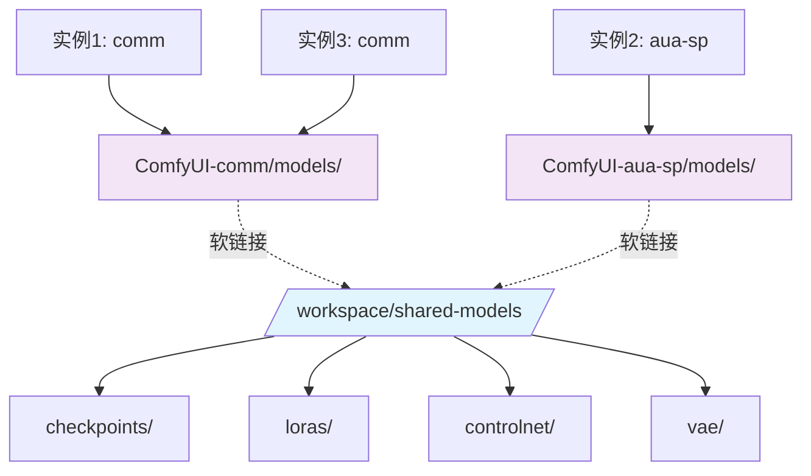
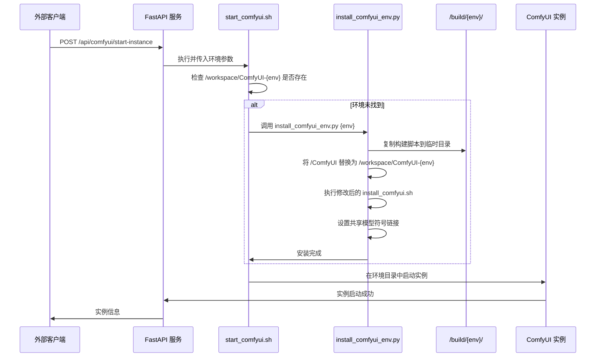
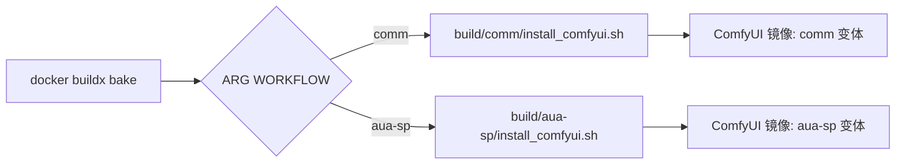

<div align="center">

# 多实例 ComfyUI Docker：可扩展的 AI 图像生成平台

[](https://github.com/ashleykleynhans/comfyui-docker)
[](https://hub.docker.com/repository/docker/ashleykza/comfyui)
[](https://runpod.io/console/deploy?template=9eqyhd7vs0&ref=2xxro4sy)
<br>

![Template Version](https://img.shields.io/github/v/tag/ashleykleynhans/comfyui-docker?style=for-the-badge&logo=data%3Aimage%2Fsvg%2Bxml%3Bbase64%2CPD94bWwgdmVyc2lvbj0iMS4wIiBlbmNvZGluZz0idXRmLTgiPz4KPCEtLSBHZW5lcmF0b3I6IEFkb2JlIElsbHVzdHJhdG9yIDI2LjUuMywgU1ZHIEV4cG9ydCBQbHVnLUluIC4gU1ZHIFZlcnNpb246IDYuMDAgQnVpbGQgMCkgIC0tPgo8c3ZnIHZlcnNpb249IjEuMSIgaWQ9IkxheWVyXzEiIHhtbG5zPSJodHRwOi8vd3d3LnczLm9yZy8yMDAwL3N2ZyIgeG1sbnM6eGxpbms9Imh0dHA6Ly93d3cudzMub3JnLzE5OTkveGxpbmsiIHg9IjBweCIgeT0iMHB4IgoJIHZpZXdCb3g9IjAgMCAyMDAwIDIwMDAiIHN0eWxlPSJlbmFibGUtYmFja2dyb3VuZDpuZXcgMCAwIDIwMDAgMjAwMDsiIHhtbDpzcGFjZT0icHJlc2VydmUiPgo8c3R5bGUgdHlwZT0idGV4dC9jc3MiPgoJLnN0MHtmaWxsOiM2NzNBQjc7fQo8L3N0eWxlPgo8Zz4KCTxnPgoJCTxwYXRoIGNsYXNzPSJzdDAiIGQ9Ik0xMDE3Ljk1LDcxMS4wNGMtNC4yMiwyLjM2LTkuMTgsMy4wMS0xMy44NiwxLjgyTDM4Ni4xNyw1NTUuM2MtNDEuNzItMTAuNzYtODYuMDItMC42My0xMTYuNiwyOS43MwoJCQlsLTEuNCwxLjM5Yy0zNS45MiwzNS42NS0yNy41NSw5NS44LDE2Ljc0LDEyMC4zbDU4NC4zMiwzMjQuMjNjMzEuMzYsMTcuNCw1MC44Miw1MC40NSw1MC44Miw4Ni4zMnY4MDYuNzYKCQkJYzAsMzUuNDktMzguNDEsNTcuNjctNjkuMTUsMzkuOTRsLTcwMy4xNS00MDUuNjRjLTIzLjYtMTMuNjEtMzguMTMtMzguNzgtMzguMTMtNjYuMDJWNjY2LjYzYzAtODcuMjQsNDYuNDUtMTY3Ljg5LDEyMS45Mi0yMTEuNjYKCQkJTDkzMy44NSw0Mi4xNWMyMy40OC0xMy44LDUxLjQ3LTE3LjcsNzcuODMtMTAuODRsNzQ1LjcxLDE5NC4xYzMxLjUzLDguMjEsMzYuOTksNTAuNjUsOC41Niw2Ni41N0wxMDE3Ljk1LDcxMS4wNHoiLz4KCQk8cGF0aCBjbGFzcz0ic3QwIiBkPSJNMTUyNy43NSw1MzYuMzhsMTI4Ljg5LTc5LjYzbDE4OS45MiwxMDkuMTdjMjcuMjQsMTUuNjYsNDMuOTcsNDQuNzMsNDMuODIsNzYuMTVsLTQsODU3LjYKCQkJYy0wLjExLDI0LjM5LTEzLjE1LDQ2Ljg5LTM0LjI1LDU5LjExbC03MDEuNzUsNDA2LjYxYy0zMi4zLDE4LjcxLTcyLjc0LTQuNTktNzIuNzQtNDEuOTJ2LTc5Ny40MwoJCQljMC0zOC45OCwyMS4wNi03NC45MSw1NS4wNy05My45Nmw1OTAuMTctMzMwLjUzYzE4LjIzLTEwLjIxLDE4LjY1LTM2LjMsMC43NS00Ny4wOUwxNTI3Ljc1LDUzNi4zOHoiLz4KCQk8cGF0aCBjbGFzcz0ic3QwIiBkPSJNMTUyNC4wMSw2NjUuOTEiLz4KCTwvZz4KPC9nPgo8L3N2Zz4K&logoColor=%23ffffff&label=Template%20Version&color=%23673ab7)

**语言选择 | Language:** [English](README.md) | [中文](README_zh.md)

</div>

## 🚀 核心特性

- **多实例支持**：在单台机器上运行多个不同配置的 ComfyUI 实例
- **智能环境管理**：使用构建脚本复制和动态路径替换的按需智能安装
- **多工作流构建支持**：通过 ARG 参数配置构建不同工作流特定的镜像（comm、aua-sp）
- **共享模型架构**：所有实例共享相同的模型文件，大幅减少磁盘使用
- **外部 API 控制**：通过 RESTful API 调用启动、停止和管理实例
- **环境隔离**：每个环境在独立目录中运行，拥有专用的虚拟环境
- **资源高效**：默认不运行任何 ComfyUI 实例，仅启动 FastAPI 服务进行外部控制
- **构建脚本复制**：创新的构建脚本复制和路径修改技术，用于环境特定安装

## 🏗️ 系统架构

### 构建时 vs 运行时架构


### 共享模型架构



### 智能环境安装流程



## 📁 目录结构

```
/workspace/
├── shared-models/              # 共享模型存储（所有实例）
│   ├── checkpoints/
│   ├── loras/
│   ├── controlnet/
│   └── vae/
├── ComfyUI-comm/               # 通用环境
│   ├── models/ -> ../shared-models/
│   ├── custom_nodes/
│   └── venv/
├── ComfyUI-aua-sp/             # 专用环境
│   ├── models/ -> ../shared-models/
│   ├── custom_nodes/
│   └── venv/
└── logs/                       # 实例日志
    ├── comfyui_instance_0.log
    ├── comfyui_instance_1.log
    └── ...
```

## 💻 安装组件

* Ubuntu 22.04 LTS
* CUDA 12.8 / 12.4（默认 12.8）
* Python 3.12.9 / 3.11.12（默认 3.12.9）
* Torch 2.7.0 / 2.6.0（默认 2.7.0）
* xformers 0.0.30 / 0.0.29.post3（默认 0.0.30）
* [Jupyter Lab](https://github.com/jupyterlab/jupyterlab)
* [code-server](https://github.com/coder/code-server)
* [ComfyUI](https://github.com/comfyanonymous/ComfyUI) v0.3.40
* [runpodctl](https://github.com/runpod/runpodctl)
* [OhMyRunPod](https://github.com/kodxana/OhMyRunPod)
* [RunPod File Uploader](https://github.com/kodxana/RunPod-FilleUploader)
* [croc](https://github.com/schollz/croc)
* [rclone](https://rclone.org/)
* [Application Manager](https://github.com/ashleykleynhans/app-manager)
* [CivitAI Downloader](https://github.com/ashleykleynhans/civitai-downloader)

### 🔧 ComfyUI 自定义节点

#### 通用环境 (`comm`)
* [ComfyUI-Manager](https://github.com/ltdrdata/ComfyUI-Manager) - 节点管理器
* [ComfyUI-Advanced-ControlNet](https://github.com/Kosinkadink/ComfyUI-Advanced-ControlNet) - 高级控制网络
* [comfyui_controlnet_aux](https://github.com/Fannovel16/comfyui_controlnet_aux) - 控制网络辅助工具
* [comfyui-inpaint-nodes](https://github.com/Acly/comfyui-inpaint-nodes) - 图像修复节点
* [masquerade-nodes-comfyui](https://github.com/BadCafeCode/masquerade-nodes-comfyui) - 蒙版处理节点
* [ComfyUI-Florence2](https://github.com/kijai/ComfyUI-Florence2) - Florence2 视觉模型
* [ComfyUI-segment-anything-2](https://github.com/kijai/ComfyUI-segment-anything-2) - SAM2 分割模型
* [ComfyUI_essentials](https://github.com/cubiq/ComfyUI_essentials) - 基础工具节点
* [ComfyUI-Custom-Scripts](https://github.com/pythongosssss/ComfyUI-Custom-Scripts) - 自定义脚本
* [ComfyUI_Comfyroll_CustomNodes](https://github.com/Suzie1/ComfyUI_Comfyroll_CustomNodes) - Comfyroll 自定义节点
* [ComfyUI-Gemini_Flash_2.0_Exp](https://github.com/ShmuelRonen/ComfyUI-Gemini_Flash_2.0_Exp) - Gemini Flash 2.0 实验版
* [ComfyUI-FastAPI](https://github.com/Be-As-One/comfyui-fastapi) - FastAPI 集成

#### 专业环境 (`aua-sp`)
包含所有通用节点，另外还有专门的高级模型和 LoRA，适用于特殊用例。

## 🌐 在 RunPod 上使用

这个镜像专为 [RunPod](https://runpod.io?ref=2xxro4sy) 设计。
您可以使用我的自定义 [RunPod 模板](
https://runpod.io/console/deploy?template=9eqyhd7vs0&ref=2xxro4sy)
在 RunPod 上启动。

## 🛠️ 构建 Docker 镜像

> [!NOTE]
> 您需要编辑 `docker-bake.hcl` 文件并更新 `REGISTRY_USER` 和 `RELEASE`。
> 您显然也可以编辑其他值，但这些是最重要的。

> [!IMPORTANT]
> 为了缓存模型，您需要至少 32GB 的 CPU/系统内存（不是显存），
> 因为模型文件很大。如果您的系统内存少于 32GB，
> 可以注释或删除 `Dockerfile` 中缓存模型的代码。

```bash
# 克隆仓库
git clone https://github.com/ashleykleynhans/comfyui-docker.git

# 登录 Docker Hub
docker login

# 构建默认镜像（CUDA 12.8 和 Python 3.12），标记镜像，并推送到 Docker Hub
docker buildx bake -f docker-bake.hcl --push

# 或构建不同镜像（如 CUDA 12.4 和 Python 3.11），标记镜像，并推送到 Docker Hub
docker buildx bake -f docker-bake.hcl cu124-py311 --push

# 或构建所有镜像，标记镜像，并推送到 Docker Hub
docker buildx bake -f docker-bake.hcl all --push

# 同上但自定义注册表/用户/版本：
REGISTRY=ghcr.io REGISTRY_USER=myuser RELEASE=my-release docker buildx \
    bake -f docker-bake.hcl --push
```

## 🚀 本地运行

### 安装 Nvidia CUDA 驱动

- [Linux](https://docs.nvidia.com/cuda/cuda-installation-guide-linux/index.html)
- [Windows](https://docs.nvidia.com/cuda/cuda-installation-guide-microsoft-windows/index.html)

### 启动 Docker 容器

```bash
docker run -d \
  --gpus all \
  -v /workspace \
  -p 2999:2999 \
  -p 3000-3010:3001-3011 \
  -p 7777:7777 \
  -p 8000:8000 \
  -p 8001:8001 \
  -p 8888:8888 \
  -e JUPYTER_PASSWORD=Jup1t3R! \
  -e DISABLE_AUTOLAUNCH=true \
  ashleykza/comfyui:latest
```

您显然可以用自己的镜像名称和标签替换。

## 🔌 端口

| 连接端口     | 内部端口      | 描述                      |
|-------------|--------------|---------------------------|
| 3000-3010   | 3001-3011    | ComfyUI 实例（多端口）      |
| 7777        | 7777         | Code Server               |
| 8000        | 8000         | Application Manager       |
| 8001        | 8001         | FastAPI（实例管理）        |
| 8888        | 8888         | Jupyter Lab               |
| 2999        | 2999         | RunPod File Uploader      |

## 🎛️ 环境变量

| 变量                   | 描述                                                                      | 默认值                  |
|-----------------------|---------------------------------------------------------------------------|------------------------|
| JUPYTER_LAB_PASSWORD  | 设置 Jupyter lab 密码                                                      | 未设置 - 无密码         |
| DISABLE_AUTOLAUNCH    | 禁用 ComfyUI 自动启动（推荐用于多实例）                                    | true                   |
| SKIP_MODEL_DOWNLOAD   | 跳过环境安装时的模型下载（加快启动速度）                                     | （未设置）              |
| DISABLE_SYNC          | 如果使用 RunPod 网络卷，禁用同步                                           | （未设置）              |
| COMFYUI_ENVIRONMENT   | 默认使用的环境（comm/aua-sp）                                             | comm                   |
| COMFYUI_BASE_PORT     | ComfyUI 实例的基础端口                                                     | 3001                   |
| EXTRA_ARGS            | 指定 ComfyUI 的额外命令行参数，如 `--lowvram`、`--disable-xformers` 等    | （未设置）              |

## 🔌 外部 API 使用

容器在端口 8001 上暴露 FastAPI 服务，用于外部管理 ComfyUI 实例。

### FastAPI 任务工作流系统

FastAPI 服务包含智能任务路由系统，根据工作流类型自动将任务分配到相应的 ComfyUI 环境：

#### 任务结构
通过 `/comfyui-fetch-task` 获取任务时，系统返回：
```json
{
    "taskId": "task_xxx",
    "workflow_name": "clothes_prompt_changer_with_auto",  // 工作流标识符
    "environment": "aua-us",                              // 目标环境（系统自动确定）
    "target_port": 3002,                                  // ComfyUI 端口（系统自动确定）
    "params": {
        "input_data": {
            "wf_json": {...}  // 实际的工作流 JSON 内容
        }
    },
    "status": "PENDING"
}
```

**注意**：`environment` 和 `target_port` 字段是系统根据 `workflow_name` 自动确定的。它们是输出字段，用于告知调用方应该使用哪个环境和端口来执行工作流。

#### 工作流路由配置
系统使用环境配置文件（`/config/environments/{environment}/config.json`）将工作流映射到特定环境：
- `clothes_prompt_changer_with_auto` → `aua-us` (端口 3002)
- `clothes_prompt_changer_with_mask` → `aua-us` (端口 3002)
- 其他工作流 → 根据配置分配

#### 任务 API 端点
- `GET /comfyui-fetch-task` - 获取下一个待处理任务
- `POST /comfyui-update-task` - 更新任务状态
- `GET /tasks` - 列出所有任务
- `POST /tasks/create/{workflow_name}` - 为特定工作流创建任务
- `GET /workflows` - 获取可用工作流和映射关系
- `GET /environments` - 获取环境配置

### 启动单个实例

```bash
curl -X POST "http://localhost:8001/api/comfyui/start-single" \
  -H "Content-Type: application/json" \
  -d '{
    "id": 0,
    "port": 3001,
    "name": "main-instance",
    "extra_args": "--lowvram",
    "enabled": true
  }' \
  --data-urlencode "environment=comm"
```

### 启动多个实例

```bash
curl -X POST "http://localhost:8001/api/comfyui/start-instances" \
  -H "Content-Type: application/json" \
  -d '{
    "environment": "comm",
    "instances": [
      {
        "id": 0,
        "port": 3001,
        "name": "main",
        "extra_args": "",
        "enabled": true
      },
      {
        "id": 1,
        "port": 3002,
        "name": "backup",
        "extra_args": "--lowvram",
        "enabled": true
      }
    ]
  }'
```

### 检查实例状态

```bash
curl -X GET "http://localhost:8001/api/comfyui/status"
```

### 停止所有实例

```bash
curl -X POST "http://localhost:8001/api/comfyui/stop-all"
```

### 直接容器命令

```bash
# 直接启动实例
docker exec your-container bash -c \
  'COMFYUI_ENVIRONMENT=comm INSTANCE_PORT=3001 INSTANCE_NAME=main /start_comfyui.sh 0'

# 检查状态
docker exec your-container /stop_comfyui.sh status

# 停止所有实例
docker exec your-container /stop_comfyui.sh all

# 停止特定实例
docker exec your-container /stop_comfyui.sh instance 0
```

> 详细的 API 文档和高级使用示例，请参阅：
> - [scripts/EXTERNAL_API_EXAMPLE.md](scripts/EXTERNAL_API_EXAMPLE.md) - 完整的 API 集成指南
> - [scripts/MULTI_INSTANCE_USAGE.md](scripts/MULTI_INSTANCE_USAGE.md) - 多实例配置指南

## 📊 日志

ComfyUI 为每个实例创建单独的日志文件：

| 应用程序            | 日志文件                               |
|---------------------|----------------------------------------|
| ComfyUI 实例 0      | /workspace/logs/comfyui_instance_0.log |
| ComfyUI 实例 1      | /workspace/logs/comfyui_instance_1.log |
| ComfyUI 实例 N      | /workspace/logs/comfyui_instance_N.log |
| FastAPI             | /workspace/logs/fastapi.log            |

您可以跟踪单个实例日志：
```bash
tail -f /workspace/logs/comfyui_instance_0.log
```

## 🧠 智能环境管理系统

本项目采用创新的环境管理系统，结合构建时效率和运行时灵活性。

### 构建脚本复制技术

系统使用先进的构建脚本复制机制：

1. **模板准备**：为每种工作流类型（`comm`、`aua-sp`）在 `/build/{workflow}/` 准备构建脚本
2. **动态复制和修改**：需要新环境时，`install_comfyui_env.py` 将构建脚本复制到临时目录
3. **路径转换**：脚本中的所有路径动态替换，从 `/ComfyUI` 改为 `/workspace/ComfyUI-{environment}`
4. **隔离执行**：修改后的脚本在隔离环境中运行，创建环境特定的安装

### 多工作流构建系统



### 环境安装过程

当 `start_comfyui.sh` 检测到缺失环境时：

```bash
# start_comfyui.sh 中的环境检查
if [[ ! -d "${COMFYUI_DIR}" || ! -f "${COMFYUI_DIR}/main.py" ]]; then
    echo "COMFYUI: Environment ${COMFYUI_ENVIRONMENT} not found. Installing..."
    /install_comfyui_env.py "${COMFYUI_ENVIRONMENT}"
fi
```

安装器执行以下步骤：
1. **验证**：检查请求的环境是否有效（`comm`、`aua-us`、`aua-sp`）
2. **构建脚本发现**：在 `/build/{environment}/` 中定位相应的构建脚本
3. **模板复制**：将构建脚本复制到临时工作目录
4. **路径替换**：将所有 `/ComfyUI` 引用替换为 `/workspace/ComfyUI-{environment}`
5. **执行**：使用环境变量运行修改后的安装脚本
6. **共享模型设置**：创建到共享模型目录的符号链接
7. **自定义节点安装**：下载并安装环境特定的自定义节点
8. **依赖修复**：运行环境特定的依赖修复脚本（`fix_dependencies.sh`）
9. **验证**：确认安装成功完成

### 环境特定配置

每个环境现在都有自己的配置目录结构：

```
/config/environments/
├── comm/
│   ├── config.json          # 环境配置（节点、模型、工作流）
│   └── fix_dependencies.sh  # 环境特定的依赖修复
├── aua-us/
│   ├── config.json
│   └── fix_dependencies.sh
└── aua-sp/
    ├── config.json
    └── fix_dependencies.sh
```

这种模块化方法具有以下优点：
- **环境特定依赖**：每个环境可以有不同的依赖要求
- **隔离配置**：对一个环境的更改不会影响其他环境
- **易于维护的更新**：可以轻松更新特定环境配置

## 💡 此架构的优势

### 技术创新
- **构建脚本复制**：先进的构建脚本复制和路径转换技术
- **动态路径替换**：自动将路径从 `/ComfyUI` 修改为环境特定路径
- **多工作流构建**：单个 Dockerfile 通过 ARG 参数支持多种工作流变体
- **模板化安装**：可重用的安装模板，确保环境创建的一致性

### 资源效率
- **共享模型**：所有实例共享相同的模型文件，节省 GB 级磁盘空间
- **按需安装**：只在需要时安装环境
- **无空闲资源**：容器启动时仅运行最少的服务
- **优化构建流程**：单个基础镜像支持多种环境类型

### 可扩展性
- **多实例**：同时运行不同的 ComfyUI 配置
- **负载分布**：在多个实例间分配工作负载
- **环境隔离**：每个环境都有自己的依赖和自定义节点
- **水平扩展**：轻松复制成功的环境配置

### 管理简便性
- **外部 API 控制**：通过 REST API 完整的实例生命周期管理
- **统一日志**：每个实例的单独日志，命名一致
- **状态监控**：实时实例状态和端口信息
- **智能环境检测**：需要时自动安装环境

### 灵活性
- **多环境**：支持不同的 ComfyUI 设置（comm、aua-sp）
- **动态配置**：每个实例可以有不同的启动参数
- **易于集成**：与编排系统的简单 API 集成
- **可扩展架构**：简单添加新的工作流类型和环境

## 🤝 社区和贡献

欢迎在 [GitHub](https://github.com/ashleykleynhans/comfyui-docker) 
上提交 Pull Request 和 Issue。鼓励错误修复和新功能。

