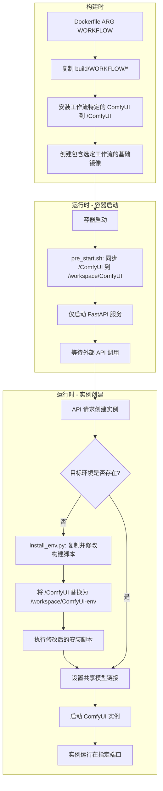
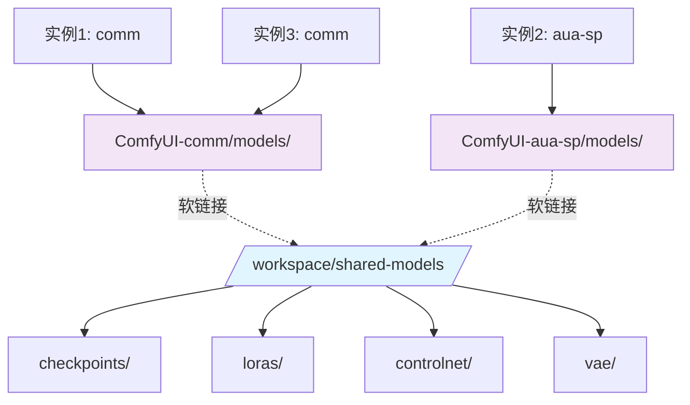
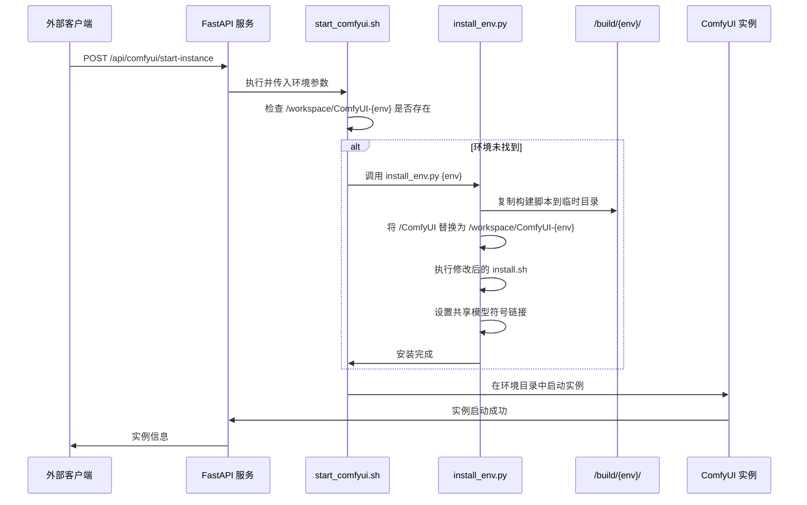
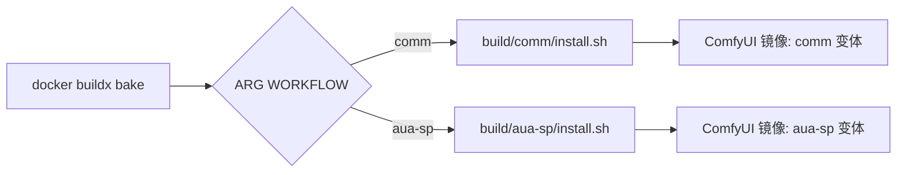

<div align="center">

# 多实例 ComfyUI Docker：可扩展的 AI 图像生成平台

[](https://github.com/ashleykleynhans/comfyui-docker)
[](https://hub.docker.com/repository/docker/ashleykza/comfyui)
[](https://runpod.io/console/deploy?template=9eqyhd7vs0&ref=2xxro4sy)
<br>

![Template Version](https://img.shields.io/github/v/tag/ashleykleynhans/comfyui-docker?style=for-the-badge&logo=data%3Aimage%2Fsvg%2Bxml%3Bbase64%2CPD94bWwgdmVyc2lvbj0iMS4wIiBlbmNvZGluZz0idXRmLTgiPz4KPCEtLSBHZW5lcmF0b3I6IEFkb2JlIElsbHVzdHJhdG9yIDI2LjUuMywgU1ZHIEV4cG9ydCBQbHVnLUluIC4gU1ZHIFZlcnNpb246IDYuMDAgQnVpbGQgMCkgIC0tPgo8c3ZnIHZlcnNpb249IjEuMSIgaWQ9IkxheWVyXzEiIHhtbG5zPSJodHRwOi8vd3d3LnczLm9yZy8yMDAwL3N2ZyIgeG1sbnM6eGxpbms9Imh0dHA6Ly93d3cudzMub3JnLzE5OTkveGxpbmsiIHg9IjBweCIgeT0iMHB4IgoJIHZpZXdCb3g9IjAgMCAyMDAwIDIwMDAiIHN0eWxlPSJlbmFibGUtYmFja2dyb3VuZDpuZXcgMCAwIDIwMDAgMjAwMDsiIHhtbDpzcGFjZT0icHJlc2VydmUiPgo8c3R5bGUgdHlwZT0idGV4dC9jc3MiPgoJLnN0MHtmaWxsOiM2NzNBQjc7fQo8L3N0eWxlPgo8Zz4KCTxnPgoJCTxwYXRoIGNsYXNzPSJzdDAiIGQ9Ik0xMDE3Ljk1LDcxMS4wNGMtNC4yMiwyLjM2LTkuMTgsMy4wMS0xMy44NiwxLjgyTDM4Ni4xNyw1NTUuM2MtNDEuNzItMTAuNzYtODYuMDItMC42My0xMTYuNiwyOS43MwoJCQlsLTEuNCwxLjM5Yy0zNS45MiwzNS42NS0yNy41NSw5NS44LDE2Ljc0LDEyMC4zbDU4NC4zMiwzMjQuMjNjMzEuMzYsMTcuNCw1MC44Miw1MC40NSw1MC44Miw4Ni4zMnY4MDYuNzYKCQkJYzAsMzUuNDktMzguNDEsNTcuNjctNjkuMTUsMzkuOTRsLTcwMy4xNS00MDUuNjRjLTIzLjYtMTMuNjEtMzguMTMtMzguNzgtMzguMTMtNjYuMDJWNjY2LjYzYzAtODcuMjQsNDYuNDUtMTY3Ljg5LDEyMS45Mi0yMTEuNjYKCQkJTDkzMy44NSw0Mi4xNWMyMy40OC0xMy44LDUxLjQ3LTE3LjcsNzcuODMtMTAuODRsNzQ1LjcxLDE5NC4xYzMxLjUzLDguMjEsMzYuOTksNTAuNjUsOC41Niw2Ni41N0wxMDE3Ljk1LDcxMS4wNHoiLz4KCQk8cGF0aCBjbGFzcz0ic3QwIiBkPSJNMTUyNy43NSw1MzYuMzhsMTI4Ljg5LTc5LjYzbDE4OS45MiwxMDkuMTdjMjcuMjQsMTUuNjYsNDMuOTcsNDQuNzMsNDMuODIsNzYuMTVsLTQsODU3LjYKCQkJYy0wLjExLDI0LjM5LTEzLjE1LDQ2Ljg5LTM0LjI1LDU5LjExbC03MDEuNzUsNDA2LjYxYy0zMi4zLDE4LjcxLTcyLjc0LTQuNTktNzIuNzQtNDEuOTJ2LTc5Ny40MwoJCQljMC0zOC45OCwyMS4wNi03NC45MSw1NS4wNy05My45Nmw1OTAuMTctMzMwLjUzYzE4LjIzLTEwLjIxLDE4LjY1LTM2LjMsMC43NS00Ny4wOUwxNTI3Ljc1LDUzNi4zOHoiLz4KCQk8cGF0aCBjbGFzcz0ic3QwIiBkPSJNMTUyNC4wMSw2NjUuOTEiLz4KCTwvZz4KPC9nPgo8L3N2Zz4K&logoColor=%23ffffff&label=Template%20Version&color=%23673ab7)

**语言选择 | Language:** [English](README.md) | [中文](README_zh.md)

</div>

## 📑 目录

- [🚀 核心特性](#-核心特性)
- [🏗️ 系统架构](#️-系统架构)
- [📁 目录结构](#-目录结构)
- [💻 安装组件](#-安装组件)
- [🌐 在 RunPod 上使用](#-在-runpod-上使用)
- [🛠️ 构建 Docker 镜像](#️-构建-docker-镜像)
- [🚀 本地运行](#-本地运行)
- [🔌 端口](#-端口)
- [🎛️ 环境变量](#️-环境变量)
- [🔌 外部 API 使用](#-外部-api-使用)
- [⚙️ 多实例配置](#️-多实例配置)
- [🔧 外部 API 集成示例](#-外部-api-集成示例)
- [🤖 FaceFusion 集成](#-facefusion-集成)
- [📊 日志](#-日志)
- [🧠 智能环境管理系统](#-智能环境管理系统)
- [💡 此架构的优势](#-此架构的优势)
- [🐛 故障排除](#-故障排除)
- [🤝 社区和贡献](#-社区和贡献)

## 🚀 核心特性

- **多实例支持**：在单台机器上运行多个不同配置的 ComfyUI 实例
- **智能环境管理**：使用构建脚本复制和动态路径替换的按需智能安装
- **多工作流构建支持**：通过 ARG 参数配置构建不同工作流特定的镜像（comm、aua-sp）
- **共享模型架构**：所有实例共享相同的模型文件，大幅减少磁盘使用
- **外部 API 控制**：通过 RESTful API 调用启动、停止和管理实例
- **环境隔离**：每个环境在独立目录中运行，拥有专用的虚拟环境
- **资源高效**：默认不运行任何 ComfyUI 实例，仅启动 FastAPI 服务进行外部控制
- **构建脚本复制**：创新的构建脚本复制和路径修改技术，用于环境特定安装

## 🏗️ 系统架构

### 构建时 vs 运行时架构



### 共享模型架构



### 智能环境安装流程



## 📁 目录结构

```
/workspace/
├── shared-models/              # 共享模型存储（所有实例）
│   ├── checkpoints/
│   ├── loras/
│   ├── controlnet/
│   └── vae/
├── ComfyUI-comm/               # 通用环境
│   ├── models/ -> ../shared-models/
│   ├── custom_nodes/
│   └── venv/
├── ComfyUI-aua-sp/             # 专用环境
│   ├── models/ -> ../shared-models/
│   ├── custom_nodes/
│   └── venv/
└── logs/                       # 实例日志
    ├── comfyui_instance_0.log
    ├── comfyui_instance_1.log
    └── ...
```

## 💻 安装组件

* Ubuntu 22.04 LTS
* CUDA 12.8 / 12.4（默认 12.8）
* Python 3.12.9 / 3.11.12（默认 3.12.9）
* Torch 2.7.0 / 2.6.0（默认 2.7.0）
* xformers 0.0.30 / 0.0.29.post3（默认 0.0.30）
* [Jupyter Lab](https://github.com/jupyterlab/jupyterlab)
* [code-server](https://github.com/coder/code-server)
* [ComfyUI](https://github.com/comfyanonymous/ComfyUI) v0.3.40
* [runpodctl](https://github.com/runpod/runpodctl)
* [OhMyRunPod](https://github.com/kodxana/OhMyRunPod)
* [RunPod File Uploader](https://github.com/kodxana/RunPod-FilleUploader)
* [croc](https://github.com/schollz/croc)
* [rclone](https://rclone.org/)
* [Application Manager](https://github.com/ashleykleynhans/app-manager)
* [CivitAI Downloader](https://github.com/ashleykleynhans/civitai-downloader)

### 🔧 ComfyUI 自定义节点

#### 通用环境 (`comm`)
* [ComfyUI-Manager](https://github.com/ltdrdata/ComfyUI-Manager) - 节点管理器
* [ComfyUI-Advanced-ControlNet](https://github.com/Kosinkadink/ComfyUI-Advanced-ControlNet) - 高级控制网络
* [comfyui_controlnet_aux](https://github.com/Fannovel16/comfyui_controlnet_aux) - 控制网络辅助工具
* [comfyui-inpaint-nodes](https://github.com/Acly/comfyui-inpaint-nodes) - 图像修复节点
* [masquerade-nodes-comfyui](https://github.com/BadCafeCode/masquerade-nodes-comfyui) - 蒙版处理节点
* [ComfyUI-Florence2](https://github.com/kijai/ComfyUI-Florence2) - Florence2 视觉模型
* [ComfyUI-segment-anything-2](https://github.com/kijai/ComfyUI-segment-anything-2) - SAM2 分割模型
* [ComfyUI_essentials](https://github.com/cubiq/ComfyUI_essentials) - 基础工具节点
* [ComfyUI-Custom-Scripts](https://github.com/pythongosssss/ComfyUI-Custom-Scripts) - 自定义脚本
* [ComfyUI_Comfyroll_CustomNodes](https://github.com/Suzie1/ComfyUI_Comfyroll_CustomNodes) - Comfyroll 自定义节点
* [ComfyUI-Gemini_Flash_2.0_Exp](https://github.com/ShmuelRonen/ComfyUI-Gemini_Flash_2.0_Exp) - Gemini Flash 2.0 实验版
* [ComfyUI-FastAPI](https://github.com/Be-As-One/comfyui-fastapi) - FastAPI 集成

#### 专业环境 (`aua-sp`)
包含所有通用节点，另外还有专门的高级模型和 LoRA，适用于特殊用例。

## 🌐 在 RunPod 上使用

这个镜像专为 [RunPod](https://runpod.io?ref=2xxro4sy) 设计。
您可以使用我的自定义 [RunPod 模板](
https://runpod.io/console/deploy?template=9eqyhd7vs0&ref=2xxro4sy)
在 RunPod 上启动。

## 🛠️ 构建 Docker 镜像

> [!NOTE]
> 您需要编辑 `docker-bake.hcl` 文件并更新 `REGISTRY_USER` 和 `RELEASE`。
> 您显然也可以编辑其他值，但这些是最重要的。

> [!IMPORTANT]
> 为了缓存模型，您需要至少 32GB 的 CPU/系统内存（不是显存），
> 因为模型文件很大。如果您的系统内存少于 32GB，
> 可以注释或删除 `Dockerfile` 中缓存模型的代码。

```bash
# 克隆仓库
git clone https://github.com/ashleykleynhans/comfyui-docker.git

# 登录 Docker Hub
docker login

# 构建默认镜像（CUDA 12.8 和 Python 3.12），标记镜像，并推送到 Docker Hub
docker buildx bake -f docker-bake.hcl --push

# 或构建不同镜像（如 CUDA 12.4 和 Python 3.11），标记镜像，并推送到 Docker Hub
docker buildx bake -f docker-bake.hcl cu124-py311 --push

# 或构建所有镜像，标记镜像，并推送到 Docker Hub
docker buildx bake -f docker-bake.hcl all --push

# 同上但自定义注册表/用户/版本：
REGISTRY=ghcr.io REGISTRY_USER=myuser RELEASE=my-release docker buildx \
    bake -f docker-bake.hcl --push
```

## 🚀 本地运行

### 安装 Nvidia CUDA 驱动

- [Linux](https://docs.nvidia.com/cuda/cuda-installation-guide-linux/index.html)
- [Windows](https://docs.nvidia.com/cuda/cuda-installation-guide-microsoft-windows/index.html)

### 启动 Docker 容器

```bash
docker run -d \
  --gpus all \
  -v /workspace \
  -p 2999:2999 \
  -p 3000-3010:3001-3011 \
  -p 7777:7777 \
  -p 8000:8000 \
  -p 8001:8001 \
  -p 8888:8888 \
  -e JUPYTER_PASSWORD=Jup1t3R! \
  -e DISABLE_AUTOLAUNCH=true \
  ashleykza/comfyui:latest
```

您显然可以用自己的镜像名称和标签替换。

## 🔌 端口

| 连接端口     | 内部端口      | 描述                      |
|-------------|--------------|---------------------------|
| 3000-3010   | 3001-3011    | ComfyUI 实例（多端口）      |
| 7777        | 7777         | Code Server               |
| 8000        | 8000         | Application Manager       |
| 8001        | 8001         | FastAPI（实例管理）        |
| 8888        | 8888         | Jupyter Lab               |
| 2999        | 2999         | RunPod File Uploader      |

## 🎛️ 环境变量

| 变量                   | 描述                                                                      | 默认值                  |
|-----------------------|---------------------------------------------------------------------------|------------------------|
| JUPYTER_LAB_PASSWORD  | 设置 Jupyter lab 密码                                                      | 未设置 - 无密码         |
| DISABLE_AUTOLAUNCH    | 禁用 ComfyUI 自动启动（推荐用于多实例）                                    | true                   |
| SKIP_MODEL_DOWNLOAD   | 跳过环境安装时的模型下载（加快启动速度）                                     | （未设置）              |
| DISABLE_SYNC          | 如果使用 RunPod 网络卷，禁用同步                                           | （未设置）              |
| COMFYUI_ENVIRONMENT   | 默认使用的环境（comm/aua-sp）                                             | comm                   |
| COMFYUI_BASE_PORT     | ComfyUI 实例的基础端口                                                     | 3001                   |
| EXTRA_ARGS            | 指定 ComfyUI 的额外命令行参数，如 `--lowvram`、`--disable-xformers` 等    | （未设置）              |

## 🔌 外部 API 使用

容器在端口 8001 上暴露 FastAPI 服务，用于外部管理 ComfyUI 实例。

### FastAPI 任务工作流系统

FastAPI 服务包含智能任务路由系统，根据工作流类型自动将任务分配到相应的 ComfyUI 环境：

#### 任务结构
通过 `/comfyui-fetch-task` 获取任务时，系统返回：
```json
{
    "taskId": "task_xxx",
    "workflow_name": "clothes_prompt_changer_with_auto",  // 工作流标识符
    "environment": "aua-us",                              // 目标环境（系统自动确定）
    "target_port": 3002,                                  // ComfyUI 端口（系统自动确定）
    "params": {
        "input_data": {
            "wf_json": {...}  // 实际的工作流 JSON 内容
        }
    },
    "status": "PENDING"
}
```

**注意**：`environment` 和 `target_port` 字段是系统根据 `workflow_name` 自动确定的。它们是输出字段，用于告知调用方应该使用哪个环境和端口来执行工作流。

#### 工作流路由配置
系统使用环境配置文件（`/config/environments/{environment}/config.json`）将工作流映射到特定环境：
- `clothes_prompt_changer_with_auto` → `aua-us` (端口 3002)
- `clothes_prompt_changer_with_mask` → `aua-us` (端口 3002)
- 其他工作流 → 根据配置分配

#### 任务 API 端点
- `GET /comfyui-fetch-task` - 获取下一个待处理任务
- `POST /comfyui-update-task` - 更新任务状态
- `GET /tasks` - 列出所有任务
- `POST /tasks/create/{workflow_name}` - 为特定工作流创建任务
- `GET /workflows` - 获取可用工作流和映射关系
- `GET /environments` - 获取环境配置

### 启动单个实例

```bash
curl -X POST "http://localhost:8001/api/comfyui/start-single" \
  -H "Content-Type: application/json" \
  -d '{
    "id": 0,
    "port": 3001,
    "name": "main-instance",
    "extra_args": "--lowvram",
    "enabled": true
  }' \
  --data-urlencode "environment=comm"
```

### 启动多个实例

```bash
curl -X POST "http://localhost:8001/api/comfyui/start-instances" \
  -H "Content-Type: application/json" \
  -d '{
    "environment": "comm",
    "instances": [
      {
        "id": 0,
        "port": 3001,
        "name": "main",
        "extra_args": "",
        "enabled": true
      },
      {
        "id": 1,
        "port": 3002,
        "name": "backup",
        "extra_args": "--lowvram",
        "enabled": true
      }
    ]
  }'
```

### 检查实例状态

```bash
curl -X GET "http://localhost:8001/api/comfyui/status"
```

### 停止所有实例

```bash
curl -X POST "http://localhost:8001/api/comfyui/stop-all"
```

### 直接容器命令

```bash
# 直接启动实例
docker exec your-container bash -c \
  'COMFYUI_ENVIRONMENT=comm INSTANCE_PORT=3001 INSTANCE_NAME=main /start_comfyui.sh 0'

# 检查状态
docker exec your-container /stop_comfyui.sh status

# 停止所有实例
docker exec your-container /stop_comfyui.sh all

# 停止特定实例
docker exec your-container /stop_comfyui.sh instance 0
```

## ⚙️ 多实例配置

### 概述
本系统支持通过配置文件灵活分配端口来运行多个 ComfyUI 实例。非常适合需要在不同端口上运行多个 ComfyUI 实例的 GPU 环境。

### 配置文件

系统使用位于根目录的 `instances.json` 配置文件（`/instances.json`）。此文件定义了所有实例及其特定设置。

#### 配置格式
```json
{
  "instances": [
    {
      "id": 0,
      "port": 3001,
      "name": "comfyui-main",
      "description": "Main ComfyUI instance",
      "extra_args": "",
      "enabled": true
    },
    {
      "id": 1,
      "port": 3005,
      "name": "comfyui-backup",
      "description": "Backup ComfyUI instance",
      "extra_args": "",
      "enabled": true
    }
  ],
  "global_settings": {
    "log_directory": "/workspace/logs",
    "pid_directory": "/workspace/logs",
    "default_extra_args": "",
    "startup_delay": 2
  }
}
```

### 环境变量（传统支持）
- `COMFYUI_ENABLE_MULTI_INSTANCE`: 设置为 "true" 以启用多实例模式
- `COMFYUI_INSTANCES`: 实例数量（用于向后兼容）

### 使用示例

#### 基本命令
```bash
# 从配置启动所有启用的实例
/start_comfyui_multi.sh start

# 停止所有实例
/start_comfyui_multi.sh stop

# 重启所有实例
/start_comfyui_multi.sh restart

# 检查所有实例的状态
/start_comfyui_multi.sh status
```

#### 高级命令
```bash
# 按名称启动特定实例
/start_comfyui_multi.sh start-by-name comfyui-main

# 按名称停止特定实例
/start_comfyui_multi.sh stop-by-name comfyui-backup

# 在端口范围内启动实例
/start_comfyui_multi.sh start-ports 3001-3005

# 显示帮助和可用命令
/start_comfyui_multi.sh help
```

#### Docker 集成
```bash
# 使用配置文件启用多实例模式
docker run -e COMFYUI_ENABLE_MULTI_INSTANCE=true your-image

# 挂载自定义配置
docker run -v /path/to/instances.json:/instances.json your-image
```

### 功能特性

#### 灵活的端口分配
与传统的顺序端口分配不同，您现在可以为任何实例分配任何端口：
```json
{
  "instances": [
    {"id": 0, "port": 3001, "name": "main"},
    {"id": 1, "port": 8080, "name": "web"},
    {"id": 2, "port": 9000, "name": "test"}
  ]
}
```

#### 实例管理
- **命名实例**：每个实例都有一个人类可读的名称
- **启用/禁用**：控制哪些实例自动启动
- **独立配置**：每个实例可以有不同的启动参数
- **GPU 就绪**：专为 GPU 环境设计，配置简单

#### 日志和 PID 文件
- **日志文件**：`/workspace/logs/comfyui_instance_<id>.log`
- **PID 文件**：`/workspace/logs/comfyui_instance_<id>.pid`

#### 配置属性
- `id`：实例的唯一标识符
- `port`：实例的端口号
- `name`：人类可读的名称
- `description`：可选描述
- `extra_args`：额外的 ComfyUI 参数（例如 "--lowvram"）
- `enabled`：此实例是否应自动启动

### 从环境变量迁移
如果您使用的是旧的环境变量方法：
```bash
# 旧方法
COMFYUI_INSTANCES=3 COMFYUI_BASE_PORT=3001

# 新方法 - 编辑 instances.json
{
  "instances": [
    {"id": 0, "port": 3001, "name": "instance-0", "enabled": true},
    {"id": 1, "port": 3002, "name": "instance-1", "enabled": true},  
    {"id": 2, "port": 3003, "name": "instance-2", "enabled": true}
  ]
}
```

## 🔧 外部 API 集成示例

### 概述
本文档提供了通过外部 API 调用与 ComfyUI 多实例系统集成的示例。

### 容器设置
ComfyUI 容器现在**默认不运行任何 ComfyUI 实例**。只有 FastAPI 服务在端口 8001 上运行。ComfyUI 实例通过外部 API 调用按需启动。

### 外部 API 实现示例

#### Python FastAPI 示例

```python
import subprocess
import json
from fastapi import FastAPI, HTTPException
from pydantic import BaseModel
from typing import List, Optional

app = FastAPI()

# Configuration
CONTAINER_NAME = "your-comfyui-container"
DOCKER_EXEC_CMD = f"docker exec {CONTAINER_NAME}"

class ComfyUIInstance(BaseModel):
    id: int
    port: int
    name: str
    extra_args: Optional[str] = ""
    enabled: Optional[bool] = True

class StartInstancesRequest(BaseModel):
    environment: Optional[str] = "comm"  # Environment type: comm or aua-sp
    instances: List[ComfyUIInstance]

@app.post("/api/comfyui/start-instances")
async def start_comfyui_instances(request: StartInstancesRequest):
    """Start ComfyUI instances using direct environment variable approach"""
    
    results = []
    
    for instance in request.instances:
        if not instance.enabled:
            continue
            
        # Set environment variables and execute
        env_vars = f'COMFYUI_ENVIRONMENT={request.environment} INSTANCE_PORT={instance.port} INSTANCE_NAME={instance.name}'
        cmd = f'{DOCKER_EXEC_CMD} bash -c "{env_vars} /start_comfyui.sh {instance.id} \'{instance.extra_args}\'"'
    
        try:
            result = subprocess.run(cmd, shell=True, capture_output=True, text=True, timeout=60)
            
            if result.returncode == 0:
                results.append({
                    "instance_id": instance.id,
                    "name": instance.name,
                    "port": instance.port,
                    "status": "started",
                    "output": result.stdout
                })
            else:
                results.append({
                    "instance_id": instance.id,
                    "name": instance.name,
                    "port": instance.port,
                    "status": "failed",
                    "error": result.stderr
                })
                
        except subprocess.TimeoutExpired:
            results.append({
                "instance_id": instance.id,
                "name": instance.name,
                "port": instance.port,
                "status": "timeout"
            })
        except Exception as e:
            results.append({
                "instance_id": instance.id,
                "name": instance.name,
                "port": instance.port,
                "status": "error",
                "error": str(e)
            })
    
    return {
        "status": "completed",
        "environment": request.environment,
        "results": results,
        "total_instances": len(request.instances),
        "started_instances": len([r for r in results if r["status"] == "started"])
    }

@app.post("/api/comfyui/stop-all")
async def stop_all_instances():
    """Stop all running ComfyUI instances"""
    
    cmd = f'{DOCKER_EXEC_CMD} /stop_comfyui.sh all'
    
    try:
        result = subprocess.run(cmd, shell=True, capture_output=True, text=True, timeout=30)
        return {
            "status": "success",
            "message": "All instances stopped",
            "output": result.stdout
        }
    except Exception as e:
        raise HTTPException(status_code=500, detail=str(e))

@app.get("/api/comfyui/status")
async def get_instances_status():
    """Get status of all ComfyUI instances"""
    
    cmd = f'{DOCKER_EXEC_CMD} /stop_comfyui.sh status'
    
    try:
        result = subprocess.run(cmd, shell=True, capture_output=True, text=True, timeout=15)
        return {
            "status": "success",
            "output": result.stdout
        }
    except Exception as e:
        raise HTTPException(status_code=500, detail=str(e))

@app.post("/api/comfyui/start-single")
async def start_single_instance(instance: ComfyUIInstance, environment: str = "comm"):
    """Start a single ComfyUI instance"""
    
    # Set environment variables and execute
    env_vars = f'COMFYUI_ENVIRONMENT={environment} INSTANCE_PORT={instance.port} INSTANCE_NAME={instance.name}'
    cmd = f'{DOCKER_EXEC_CMD} bash -c "{env_vars} /start_comfyui.sh {instance.id} \'{instance.extra_args}\'"'
    
    try:
        result = subprocess.run(cmd, shell=True, capture_output=True, text=True, timeout=30)
        
        if result.returncode == 0:
            return {
                "status": "success",
                "message": f"Instance '{instance.name}' started on port {instance.port}",
                "output": result.stdout
            }
        else:
            raise HTTPException(
                status_code=500, 
                detail=f"Failed to start instance: {result.stderr}"
            )
    except Exception as e:
        raise HTTPException(status_code=500, detail=str(e))
```

#### 使用示例

##### 1. 启动多个实例
```bash
curl -X POST "http://your-api-host/api/comfyui/start-instances" \
  -H "Content-Type: application/json" \
  -d '{
    "environment": "comm",
    "instances": [
      {
        "id": 0,
        "port": 3001,
        "name": "comfyui-main",
        "extra_args": "",
        "enabled": true
      },
      {
        "id": 1,
        "port": 3005,
        "name": "comfyui-backup",
        "extra_args": "--lowvram",
        "enabled": true
      }
    ]
  }'
```

##### 2. 启动单个实例
```bash
curl -X POST "http://your-api-host/api/comfyui/start-single" \
  -H "Content-Type: application/json" \
  -d '{
    "id": 0,
    "port": 3001,
    "name": "comfyui-quick",
    "extra_args": "",
    "enabled": true
  }'
```

##### 3. 检查状态
```bash
curl -X GET "http://your-api-host/api/comfyui/status"
```

##### 4. 停止所有实例
```bash
curl -X POST "http://your-api-host/api/comfyui/stop-all"
```

#### 直接容器命令

您也可以直接与容器交互：

```bash
# 使用环境变量启动单个实例
docker exec your-container bash -c \
  'COMFYUI_ENVIRONMENT=comm INSTANCE_PORT=3001 INSTANCE_NAME=main /start_comfyui.sh 0'

# 启动多个实例
docker exec your-container bash -c \
  'COMFYUI_ENVIRONMENT=comm INSTANCE_PORT=3001 INSTANCE_NAME=main /start_comfyui.sh 0'
docker exec your-container bash -c \
  'COMFYUI_ENVIRONMENT=aua-sp INSTANCE_PORT=3002 INSTANCE_NAME=backup /start_comfyui.sh 1'

# 检查状态
docker exec your-container /stop_comfyui.sh status

# 停止所有实例
docker exec your-container /stop_comfyui.sh all

# 停止特定实例
docker exec your-container /stop_comfyui.sh instance 0
```

#### Node.js Express 示例

```javascript
const express = require('express');
const { exec } = require('child_process');
const app = express();

app.use(express.json());

const CONTAINER_NAME = 'your-comfyui-container';

app.post('/api/comfyui/start-instances', (req, res) => {
    const { instances } = req.body;
    
    if (!instances || !Array.isArray(instances)) {
        return res.status(400).json({ error: 'Invalid instances array' });
    }
    
    const jsonConfig = JSON.stringify({ instances });
    const cmd = `docker exec ${CONTAINER_NAME} /start_comfyui_multi.sh json '${jsonConfig}'`;
    
    exec(cmd, { timeout: 60000 }, (error, stdout, stderr) => {
        if (error) {
            return res.status(500).json({ error: error.message, stderr });
        }
        
        res.json({
            status: 'success',
            message: 'Instances started',
            output: stdout,
            instances_count: instances.length
        });
    });
});

app.listen(3000, () => {
    console.log('ComfyUI API server running on port 3000');
});
```

### 配置说明

#### JSON 配置格式
```json
{
  "environment": "comm",     // 环境类型："comm" 或 "aua-sp"
  "instances": [
    {
      "id": 0,               // 唯一实例 ID
      "port": 3001,          // 此实例的端口
      "name": "main",        // 人类可读的名称
      "extra_args": "",      // 额外的 ComfyUI 参数
      "enabled": true        // 是否启动此实例
    }
  ]
}
```

#### 环境变量
- `DISABLE_AUTOLAUNCH=true`（默认）- ComfyUI 不会自动启动
- `DISABLE_AUTOLAUNCH=false` - 使用 instances.json 启用自动启动

#### 端口管理
- ComfyUI 实例：3001+（可配置）
- FastAPI 服务：8001（始终运行）
- 选择不与其他服务冲突的端口

#### 环境类型
- **comm**：带有通用模型和节点的标准 ComfyUI 环境
- **aua-sp**：带有额外功能和模型的专用环境

#### 共享模型架构
系统使用共享模型存储来优化磁盘空间和启动时间：

```
/workspace/
├── shared-models/              # 共享模型存储（软链接）
│   ├── checkpoints/
│   ├── loras/
│   ├── controlnet/
│   └── vae/
│
├── ComfyUI-comm/               # comm 环境
│   ├── models/                 # 符号链接 -> /workspace/shared-models/
│   ├── custom_nodes/           # 环境特定的节点
│   └── venv/                   # 环境特定的 Python 环境
│
└── ComfyUI-aua-sp/             # aua-sp 环境
    ├── models/                 # 符号链接 -> /workspace/shared-models/
    ├── custom_nodes/           # 环境特定的节点
    └── venv/                   # 环境特定的 Python 环境
```

**优势**：
- 模型只存储一次，节省 GB 级磁盘空间
- 快速环境切换，无需重新下载模型
- 每个环境都有隔离的自定义节点和依赖项

### 此方法的优势

1. **资源效率**：在需要之前不运行 ComfyUI 实例
2. **动态配置**：每次启动可以使用不同的设置
3. **外部控制**：通过 API 调用完全管理
4. **可扩展性**：易于与编排系统集成
5. **灵活性**：支持基于文件和 API 驱动的配置
6. **空间优化**：共享模型存储减少磁盘使用
7. **多环境**：同时支持不同的 ComfyUI 配置

## 🤖 FaceFusion 集成

本文档描述了 ComfyUI Docker 设置的 FaceFusion 人脸交换集成。

### 概述

FaceFusion 集成允许在 ComfyUI Docker 环境中使用 Be-As-One 的 FaceFusion 分支运行人脸交换服务。集成包括：

- Be-As-One FaceFusion 分支的自定义安装脚本
- FaceFusion 服务的专用启动脚本
- 与外部 FastAPI 处理程序的集成
- FaceFusion 工作流的 Docker 构建目标

### 关键组件

#### 1. 安装脚本
**位置：** `build/facefusion/install.sh`
- 从 `git@github.com:Be-As-One/facefusion.git` 安装 FaceFusion
- 使用 Python 3.12 设置 micromamba 环境
- 安装 PyTorch 和 FaceFusion 依赖项

#### 2. 启动脚本
**位置：** `scripts/start_facefusion.sh`
- 管理 FaceFusion 服务生命周期
- 与位于 `/Users/hzy/Code/zhuilai/video-faceswap/fastapi_handler.py` 的外部 FastAPI 处理程序集成
- 处理环境激活和日志记录

#### 3. 环境配置
**位置：** `config/environments/facefusion/config.json`
- 服务在端口 3005 上运行
- 配置用于人脸交换工作流
- 指定外部 FastAPI 处理程序集成

#### 4. Docker 构建配置
**位置：** `docker-bake.hcl`
- 添加了带有 CUDA 12.4 和 12.8 目标的 `facefusion` 组
- 包括 FaceFusion 特定的构建参数
- 支持 `facefusion-cu124-py312` 和 `facefusion-cu128-py312` 目标

### 使用方法

#### 构建 FaceFusion Docker 镜像

```bash
# 为所有 CUDA 版本构建 FaceFusion 镜像
docker buildx bake facefusion

# 构建特定 CUDA 版本
docker buildx bake facefusion-cu128-py312
```

#### 运行 FaceFusion 容器

```bash
# 运行时挂载外部 FastAPI 处理程序
docker run -d \
  --name comfyui-facefusion \
  --gpus all \
  -p 3005:3005 \
  -v /Users/hzy/Code/zhuilai/video-faceswap:/external/video-faceswap \
  your-registry/comfyui:facefusion-cu128-py312-latest

# 在容器内启动 FaceFusion 服务
docker exec comfyui-facefusion /start_facefusion.sh
```

#### 服务管理

```bash
# 检查 FaceFusion 服务状态
docker exec comfyui-facefusion /start_facefusion.sh status

# 查看服务日志
docker exec comfyui-facefusion tail -f /workspace/logs/facefusion.log

# 停止服务（如需要）
docker exec comfyui-facefusion pkill -f fastapi_handler.py
```

### 要求

#### 外部依赖
- **FaceFusion FastAPI 处理程序**：`/Users/hzy/Code/zhuilai/video-faceswap/fastapi_handler.py`
- **Video FaceSwap 仓库**：必须在运行时可用于卷挂载

#### 系统要求
- 支持 CUDA 的 NVIDIA GPU
- 支持 BuildKit 的 Docker
- 足够的磁盘空间用于 FaceFusion 模型

### API 端点

运行后，FaceFusion 服务在端口 3005 上暴露 API 端点：

```bash
# 健康检查
curl http://localhost:3005/health

# 人脸交换处理
curl -X POST http://localhost:3005/process \
  -H "Content-Type: application/json" \
  -d '{
    "source_url": "https://example.com/source.jpg",
    "target_url": "https://example.com/target.jpg",
    "resolution": "1024x1024",
    "model": "inswapper_128_fp16"
  }'
```

### 集成测试

运行集成测试以验证设置：

```bash
cd /path/to/comfyui-docker
./scripts/test_facefusion_integration.sh
```

### 架构说明

- FaceFusion 在隔离的 micromamba 环境（`facefusion`）中运行
- 外部 FastAPI 处理程序提供 REST API 接口
- 服务与现有的 ComfyUI Docker 基础设施集成
- 共享模型存储架构减少磁盘使用
- 环境配置允许未来的工作流扩展

### 版本信息

- **FaceFusion 版本**：3.0.0（可通过 `FACEFUSION_VERSION` 构建参数配置）
- **Python 版本**：3.12
- **CUDA 支持**：12.4 和 12.8
- **PyTorch 版本**：2.6.0+（CUDA 12.4）/ 2.7.0+（CUDA 12.8）

## 📊 日志

ComfyUI 为每个实例创建单独的日志文件：

| 应用程序            | 日志文件                               |
|---------------------|----------------------------------------|
| ComfyUI 实例 0      | /workspace/logs/comfyui_instance_0.log |
| ComfyUI 实例 1      | /workspace/logs/comfyui_instance_1.log |
| ComfyUI 实例 N      | /workspace/logs/comfyui_instance_N.log |
| FastAPI             | /workspace/logs/fastapi.log            |

您可以跟踪单个实例日志：
```bash
tail -f /workspace/logs/comfyui_instance_0.log
```

## 🧠 智能环境管理系统

本项目采用创新的环境管理系统，结合构建时效率和运行时灵活性。

### 构建脚本复制技术

系统使用先进的构建脚本复制机制：

1. **模板准备**：为每种工作流类型（`comm`、`aua-sp`）在 `/build/{workflow}/` 准备构建脚本
2. **动态复制和修改**：需要新环境时，`install_env.py` 将构建脚本复制到临时目录
3. **路径转换**：脚本中的所有路径动态替换，从 `/ComfyUI` 改为 `/workspace/ComfyUI-{environment}`
4. **隔离执行**：修改后的脚本在隔离环境中运行，创建环境特定的安装

### 多工作流构建系统



### 环境安装过程

当 `start_comfyui.sh` 检测到缺失环境时：

```bash
# start_comfyui.sh 中的环境检查
if [[ ! -d "${COMFYUI_DIR}" || ! -f "${COMFYUI_DIR}/main.py" ]]; then
    echo "COMFYUI: Environment ${COMFYUI_ENVIRONMENT} not found. Installing..."
    /install_env.py "${COMFYUI_ENVIRONMENT}"
fi
```

安装器执行以下步骤：
1. **验证**：检查请求的环境是否有效（`comm`、`aua-us`、`aua-sp`）
2. **构建脚本发现**：在 `/build/{environment}/` 中定位相应的构建脚本
3. **模板复制**：将构建脚本复制到临时工作目录
4. **路径替换**：将所有 `/ComfyUI` 引用替换为 `/workspace/ComfyUI-{environment}`
5. **执行**：使用环境变量运行修改后的安装脚本
6. **共享模型设置**：创建到共享模型目录的符号链接
7. **自定义节点安装**：下载并安装环境特定的自定义节点
8. **依赖修复**：运行环境特定的依赖修复脚本（`fix_dependencies.sh`）
9. **验证**：确认安装成功完成

### 环境特定配置

每个环境现在都有自己的配置目录结构：

```
/config/environments/
├── comm/
│   ├── config.json          # 环境配置（节点、模型、工作流）
│   └── fix_dependencies.sh  # 环境特定的依赖修复
├── aua-us/
│   ├── config.json
│   └── fix_dependencies.sh
└── aua-sp/
    ├── config.json
    └── fix_dependencies.sh
```

这种模块化方法具有以下优点：
- **环境特定依赖**：每个环境可以有不同的依赖要求
- **隔离配置**：对一个环境的更改不会影响其他环境
- **易于维护的更新**：可以轻松更新特定环境配置

## 💡 此架构的优势

### 技术创新
- **构建脚本复制**：先进的构建脚本复制和路径转换技术
- **动态路径替换**：自动将路径从 `/ComfyUI` 修改为环境特定路径
- **多工作流构建**：单个 Dockerfile 通过 ARG 参数支持多种工作流变体
- **模板化安装**：可重用的安装模板，确保环境创建的一致性

### 资源效率
- **共享模型**：所有实例共享相同的模型文件，节省 GB 级磁盘空间
- **按需安装**：只在需要时安装环境
- **无空闲资源**：容器启动时仅运行最少的服务
- **优化构建流程**：单个基础镜像支持多种环境类型

### 可扩展性
- **多实例**：同时运行不同的 ComfyUI 配置
- **负载分布**：在多个实例间分配工作负载
- **环境隔离**：每个环境都有自己的依赖和自定义节点
- **水平扩展**：轻松复制成功的环境配置

### 管理简便性
- **外部 API 控制**：通过 REST API 完整的实例生命周期管理
- **统一日志**：每个实例的单独日志，命名一致
- **状态监控**：实时实例状态和端口信息
- **智能环境检测**：需要时自动安装环境

### 灵活性
- **多环境**：支持不同的 ComfyUI 设置（comm、aua-sp）
- **动态配置**：每个实例可以有不同的启动参数
- **易于集成**：与编排系统的简单 API 集成
- **可扩展架构**：简单添加新的工作流类型和环境

## 🐛 故障排除

### 常见问题

#### 1. ComfyUI 实例无法启动

**症状**：实例启动失败或立即退出

**解决方案**：
- 检查日志文件：`tail -f /workspace/logs/comfyui_instance_0.log`
- 验证端口是否被占用：`lsof -i :3001`
- 确保环境已正确安装：`ls -la /workspace/ComfyUI-{environment}`
- 检查 GPU 可用性：`nvidia-smi`

#### 2. 环境安装失败

**症状**：`Environment {environment} not found. Installing...` 后失败

**解决方案**：
- 检查构建脚本是否存在：`ls -la /build/{environment}/`
- 验证磁盘空间：`df -h`
- 查看安装日志中的错误
- 确保所有依赖项都可访问

#### 3. 外部 API 调用失败

**症状**：API 返回 500 错误或超时

**解决方案**：
- 验证 FastAPI 服务正在运行：`curl http://localhost:8001/health`
- 检查 Docker 执行权限
- 增加 API 调用的超时值
- 查看 FastAPI 日志：`tail -f /workspace/logs/fastapi.log`

#### 4. 共享模型未找到

**症状**：模型加载失败，找不到检查点

**解决方案**：
- 验证符号链接：`ls -la /workspace/ComfyUI-{env}/models`
- 检查共享模型目录：`ls -la /workspace/shared-models/`
- 确保模型文件存在于正确位置
- 重新创建符号链接（如需要）

#### 5. FaceFusion 集成问题

**外部 FastAPI 处理程序未找到**
- 确保 `/Users/hzy/Code/zhuilai/video-faceswap/fastapi_handler.py` 存在
- 检查 Docker run 命令中的卷挂载

**FaceFusion 安装失败**
- 验证对 `git@github.com:Be-As-One/facefusion.git` 的 SSH 访问
- 检查构建日志中的依赖项问题

**服务无法启动**
- 检查 micromamba 环境激活
- 验证 Python 依赖项已安装
- 查看日志：`/workspace/logs/facefusion.log`

### 调试命令

```bash
# 检查所有运行中的 ComfyUI 进程
ps aux | grep comfyui

# 查看特定实例的详细日志
tail -n 100 -f /workspace/logs/comfyui_instance_0.log

# 检查端口使用情况
netstat -tlnp | grep 300

# 验证环境安装
ls -la /workspace/ComfyUI-*/

# 检查 Python 环境
source /workspace/ComfyUI-comm/venv/bin/activate && pip list

# 测试 API 连接
curl -v http://localhost:8001/api/comfyui/status

# 检查磁盘空间
df -h /workspace

# 监控 GPU 使用情况
watch -n 1 nvidia-smi
```

### 性能优化

#### 内存不足
- 使用 `--lowvram` 或 `--cpu` 参数启动实例
- 减少同时运行的实例数量
- 考虑使用更小的模型

#### 启动时间慢
- 设置 `SKIP_MODEL_DOWNLOAD=true` 跳过模型下载
- 使用预构建的环境镜像
- 增加 `startup_delay` 在 instances.json 中

#### GPU 利用率低
- 检查是否启用了 xformers：`--xformers`
- 验证 CUDA 版本兼容性
- 监控 GPU 内存分配

### 获取帮助

如果问题持续存在：
1. 收集相关日志文件
2. 记录您的配置（instances.json、环境变量）
3. 在 GitHub 上创建详细的问题报告
4. 包括系统规格（GPU、CUDA 版本、Docker 版本）

## 🤝 社区和贡献

欢迎在 [GitHub](https://github.com/ashleykleynhans/comfyui-docker) 
上提交 Pull Request 和 Issue。鼓励错误修复和新功能。

